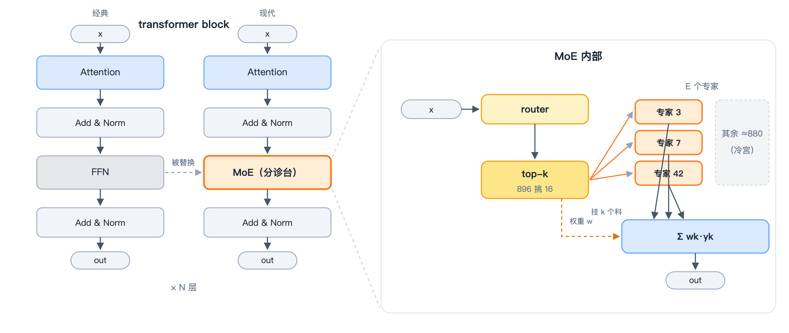

# 第一章｜MoE 是什么，什么又是 Mega-MoE

> **入门主线 · 基础篇 1/3** ｜ [返回目录](../README.md)

## 1.1 先看 MoE 在哪：transformer block 里的"分诊台"

什么是 Mega-MoE？

拆开看，这个词的核心肯定是 MoE（mixture of experts），它是现代 transformer block 中的核心单元。
一个经典的 transformer block 就两件套：注意力（attention）+ 前馈网络（FFN）。之所以分"经典"和"现代"两说，是因为在那篇大名鼎鼎的《Attention Is All You Need》刚刚发表的时候，这个位置还是线性层（FFN），后面在主流的大模型中才被 MoE 替代。那为什么会变成这个样子呢？因为线性层的计算量太大——举个例子：LLaMA-70B 的一个 FFN 层就有约 7 亿参数（hidden 8192、中间维 28672 的 SwiGLU），每个 token 过一层要付约 1.4 GFLOP，80 层叠下来光 FFN 就是上百 GFLOP，而且这一项占了全模型约三分之二的计算量。计算量大意味着算得慢、耗时长，无论训练场景还是推理场景都不可接受（时间就是金钱）。所以 MoE 就是把线性层切成一块一块的，每次只激活其中一小部分就足够了。

于是，"FFN 线性层太大"的问题，就变成了"选 FFN 中的哪一部分来算"的问题。（不过 MoE 的静态显存仍然非常惊人，甚至比原来 FFN 那几个矩阵还大——2026 年存储涨价的锅，MoE 也得分一半。这笔账下文我就来算，解决方案放在第八章。）

MoE 做的事情说来简单——**把 FFN 换成一个"分诊台 + 一排专科医生"**：



*画出来就是这样：左面板看 MoE 在 transformer 里的位置——经典 block 的 FFN 被换成分诊台，Attention 原样保留，整个 block 再堆 N 层；右面板把分诊台拆开——router 给每个 token 挑 k 个专科医生（图中 3/7/42 被选中），其余 ≈880 个专家躺冷宫，k 个判决按门控权重加权求和出 out。*

- **router** 是一个很小的线性层：`logits = x @ Wr`，对每个 token 算出它对 E 个专家的"亲和度"；
- **top-k 选择**：每个 token 只去 k 个专家（比如 8 个里挑 2 个、896 个里挑 16 个），选中概率经 softmax/sigmoid 归一成**门控权重（gate weight）**，当然有人会想到是不是这个亲和度会造成有的专家被反复cue到，有的专家门可罗雀————是的，这个问题会在第七章讨论；
- **专家（expert）** 就是一个普普通通的 FFN（通常是 SwiGLU 结构），每个专家有自己的一份权重；
- 最后把 k 个专家的输出按门控权重加权求和，得到这一层的输出。

这里也提一下这个输入 x 到底是什么。为了简单起见（当然很不严谨），就把这个 x 看成是 token，一个 token 的大小是 hidden_size。当然，一句话不可能只有一个 token，一次也不会只往模型里塞一句话，这就引出了序列长度（seq_len）和批大小（batch_size）两个概念；简单起见把这俩相乘，记 S = seq_len × batch_size，所以我们说的输入数据就是若干个 token，维度为 [S, hidden_size]。现在序列长度都要干到 1M 了，代进去看看就知道，这同样是个庞大的数字。

然后回到另一个词mega（make america great again!哈哈哈当然不是）————mega 其实就是"大"的意思。

规模的扩大是深度学习的铁律，千万不要觉得它暴力，要看到它的大道至简。这里"大"的深层次含义，是把许多独立的操作混在了一起：**这种组合不是简单地加在一起，而是七个葫芦娃合体变身金刚葫芦娃**！什么意思，合起来肯定是能有性能收益的，要有1+1大于2的效果。

总之，严肃地说，Mega-MoE 就是把 MoE 的计算操作和通信操作（通信诉求怎么来的，下文分析）合在一起，焊成一个大算子。为什么要这样合起来，难道就是为了显得好看么？且继续耐心往下看。

## 1.2 真实模型里MoE长什么样

我们先不谈 MoE 为什么要放到一个大 kernel 里，先来看看眼下主流的大模型里，MoE 到底长什么样子。

这一节是上一节的延伸，上一节我在反复给你说模型参数多大，你没有直观感受。

下面是三个当下很火的大模型的 MoE 层参数一览：

```python
# config/_shapes.py:202-221（摘）
CaseGroup(                       # Qwen 系 MoE
    prefix="performance-fwd-qwen", ...,
    tokens=(4096, 8192, 16384), worlds=(2, 4, 8),
    hidden=2048, ffn=768, topk=8, num_experts=128,
    capacity_factor=1.25,
),
CaseGroup(                       # DeepSeek-V4 风格
    prefix="performance-fwd-dsv4", ...,
    hidden=7168, ffn=3072, topk=6, num_experts=384,
    capacity_factor=4.0,
),
CaseGroup(                       # Kimi-K3
    prefix="performance-fwd-kimi-k3", ...,
    hidden=3584, ffn=3072, topk=16, num_experts=896,
    capacity_factor=1.25,
),
```

拿 Kimi-K3 算笔账：896 个专家、每个 token 挑 16 个。每个 token 要过 16 个专家的 FFN，但相对"896 个专家全算一遍"，计算量只有 16/896 ≈ **1.8%**——剩下 98% 的参数在冷宫里躺着，只为容量做贡献，不为每步计算付钱。这就是为什么 MoE 模型能把总参数堆到恐怖的规模而推理/训练成本可控——这也就直观地回答了"为什么要用 MoE"。

然后咱们来算一下专家的权重参数，还是以 Kimi-K3 为例：896 个专家，隐藏层是 7168/2 = 3584（Kimi-K3 做了个 latent MoE 结构，简单理解就是减半），FFN 的维度是 3072，事实上维度 [3584, 3072] 的矩阵一共有 3 个（为什么请看第二章）。假设权重都是 bf16（其实有一部分是 fp32）、两字节，所以算起来就是（3 × 3584 × 3072）× 896 × 2 = 55.2 GiB。你一看，这个数一张 64GB HBM 的卡是不是也能装下？别忘了这只是一层，按层数 100 来算，就是 55 × 100 = 5500 GB 了，况且这还只是 MoE，attention 部分的开销也有，更不说如果要考虑训练，还要考虑优化器状态、梯度这些大头了。尤其是针对训练场景的内存节省，我们在第八章还有专门的设计讨论这个问题。

而以上还只是静态成本——最简单的办法就是每张卡放一部分专家（这就是 EP，专家并行）。再加上 1.1 提到的问题：输入数据本身 [S, hidden_size] 就不是小数字，这还没算 topk 倍的拷贝（第二章会讲怎么复制这么多份）。

那么就有两种办法：一种是把所有数据放到一张卡上，它当大总管、负责分配，需要的时候把数据发出去；另一种是每张卡都均分数据——但问题来了：怎么保证每张卡分到的 token 恰好是本地专家负责算的那些？事实上做不到。所以通信变得更复杂：既要把本地专家需要的 token 从别人那里拿来，也要把自己本卡持有的数据发给别的卡，这个过程就是 dispatch，一种 all-to-all 模式的通信——而主流方案反倒是听起来更复杂的第二种。dispatch 分发完，还要把各专家对同一个 token 的判决结果收回来汇总，这又是 dispatch 的反过程，也就是 combine。具体模块我在第二章还会细讲。

这笔通信诉求到底有多大？还是接着 Kimi-K3 的账往下算：EP=8、全局 16384 个 token（每 rank 2048 个）、权重和激活都是 bf16。

**先算通信**：全网 token-专家对 = 16384 × 16 ≈ 26 万，均摊下来每个 rank 收发各 32768 行；每行 3584 维 × 2 字节 ≈ 7 KB，dispatch 一来一回、combine 再一来一回——单 rank 每个方向全程约 0.5 GB。按 500 GB/s 的可用带宽算，**光通信就是 1 ms 量级**。

**再算计算**：每 rank 分到 32768 个 token-专家对，每对是 3 个 [3584, 3072] 的 GEMM，约 2 × 3 × 3584 × 3072 ≈ 66 MFLOP，合计 ≈ 2.2 TFLOP；按一块 300 TFLOPS（bf16）的卡算，**计算约 7 ms**。

7 ms 的计算对 1 ms 的通信，通信看着不起眼？别忘了这是"完美均分"的账——串行执行，这 1 ms 是白付的；真实路由下有的专家被挤爆，最慢的卡拖累全网（多卡看 rank-MAX），这 1 ms 还会翻着番地涨。怎么把通信藏进计算的影子里，正是第三章的主戏。

总之，MoE 的出现让计算量更少，但占用的显存不降反升；显存装不下，就得让所有的卡一起扛；所有的卡一起分担权重和输入数据，又抬高了通信的成本。如何平衡这个大三角？方法有很多：数据并行（DP）、张量并行（TP）、流水线并行（PP），各种框架层的策略数不胜数。

**在计算、通信、显存这一桌并行计算的菜中，Mega-MoE 就是其中一种吃法**。

## 1.3 再看为什么需要"大算子"：三个本质收益

好，重头戏来了。上一节说到，MoE 带来了巨大的通信诉求：本来简简单单做个计算，现在通信这件事掺和进来，也要占用模型运行的时间，颇有一种捉襟见肘、拆东墙补西墙的狼狈感。那 Mega-MoE 凭什么说自己是平衡了显存、计算、通信的一种解法呢？

既然 MoE 层拆开看就是"发数据 + 两个 GEMM + 激活 + 发回来"，用现成的小算子拼不行吗？答案当然可以。事实上这样搞才是最简单的、最符合直觉的。但是就是————慢。为什么慢，本质上是三笔账（其实最关键的就是第一点）：

**第一笔：通信和计算难以互相掩盖。** 拆成小算子时，all-to-all 是 all-to-all，GEMM 是 GEMM，host 侧一个接一个下发，中间天然串行。而通信（dispatch 要把 token 发给专家所在的卡）和计算（GEMM）本来是可以并行的——dispatch 发到一块，FC1 就能算一块。**只有在一个大算子内部，这种"边收边算"的生产者-消费者流水才写得出来。** 怎么排流水，可以参考第三章，第九章。其实还有一个潜台词，就是通信和计算得是由不同的两个单元完成的，这一点在gpu和npu都符合但是对应的硬件完全不一样，感兴趣可以去第六章看看。

**第二笔：host 侧开销。** 每次 kernel launch 都有 host 侧的固定开销（微秒级）。MoE 一层拆开是十几个小算子，训练一秒要过几千层，launch 开销累积起来能吃掉百分之几的吞吐。大算子把这一层焊成**一次（或极少次）launch**。

**第三笔：内存反复读取。** 小算子之间，中间结果（dispatch 后的 token、FC1 输出、激活值）必须写回 HBM 再读出来。HBM 带宽是整个系统最贵的资源之一。大算子内部，中间结果可以留在片上缓存（UB/L0C/寄存器）里直接流给下一阶段。这一点的开山始祖是 FlashAttention 那一套，感兴趣去搜就行，相关资料一搜一大把，我就不在此赘述了。

## 1.4 后面还有什么：全书导览

本章回答的是"为什么需要 Mega-MoE"；后面八章回答"它长什么样、怎么写、怎么写好"。按阅读动线分三段：

**入门主线（第二、三章）——建议所有读者顺序读完。**

- **第二章《经典结构：从 dispatch 到 combine，从前向到反向》**：把 MoE 层拆成"排序 → dispatch → 两个 grouped GEMM 夹一个 SwiGLU → combine 归约"的一条链，再告诉你反向为什么不是镜像而是一张网——每个 GEMM 裂出 dgrad/wgrad 两个，反向计算量约为前向两倍。读完你会拿到全书通用的形状记号（T、H、F、R_e）和"分桶有序"这个一切优化的前提；
- **第三章《通信与计算掩盖的艺术》**：全书核心。先给一套"串行分析法"算清通信/计算谁是瓶颈、掩盖的理论下限在哪，再给出五招手法——引擎分工、细粒度信号、双 buffer、影子流水、尾部填充，最后用真代码看前向的"边收边算"和反向的"段内塞满"是怎么盖出来的。

**入门提高（第四、五、六章）——知道怎么接、怎么移植。**

- **第四章《通信原语：signal / wait / epoch 的实现》**：put→fence→signal 的次序为什么不能乱、信号槽为什么要用单调届号防"残影"，以及 triton-distributed-ascend 怎么把 shmem 对称内存接进 Triton。想动手改 kernel 的读者必看；
- **第五章《和 EP/DP/PP/TP 的关系，以及怎么接进框架》**：EP 是第五个并行维度；算子怎么从 nn.Module 一路接进 autograd 和宿主框架，算子自己的三本内存账与卸载思想；
- **第六章《NPU 和 GPU：两套硬件，两种掩盖哲学》**：cv 融合 vs SM 班组制、vv 融合为什么上限不高（本质是 vector/cube 算力平衡）、NPU 的亲和设计。写 CUDA 的读者可以从这章找对照。

**进阶专题（第七、八、九章）——各自独立，按需取用。**

- **第七章《MoonEP：负载均衡为什么值得焊进大算子》**：木桶效应的定量账、副本式均衡（B.0–B.3）、规划/预取/归约全部 device 侧闭环——拆的是 2.2 埋下的那颗雷；
- **第八章《省显存的艺术：重算怎么设计》**：训练场景下，激活可以重算、排列元数据绝不能重算；三档省显存菜单（压缩存/搬主机/全重算）本质是拿算力换显存的行情兑换——呼应 1.2 那笔 5500 GB 的账；
- **第九章《前向的全局流水，以及为什么反向没有》**：压轴。链可流、网只可切——前向三级波流水一次 launch 的实现，以及 kernel 内相位打点这套"内窥镜"方法。

每章开头都有一句话摘要，章末有小结和导航；赶时间的读者可以只看各章的"一句话"。

## 1.5 小结

MoE = 分诊台 + 专科医生，容量与算力解耦；Mega-MoE = 把这一层的通信、访存、计算焊成一条流水线，让三者互相掩盖。**下一章我们把这层拆开，看数据到底怎么流。**

---

← [返回目录](../README.md) ｜ [下一章：经典结构——从 dispatch 到 combine](02-dispatch-to-combine.md) →
