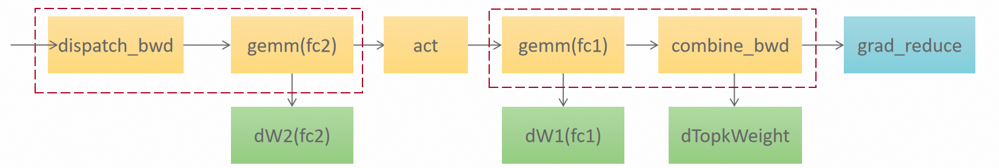

# 第二章｜经典结构：从 dispatch 到 combine，从前向到反向

> **入门主线 · 基础篇 2/3** ｜ [返回目录](../README.md)

**一句话：前向是"排序 → 发过去 → 两个 GEMM 夹一个激活 → 发回来求和"的一条链；反向不是这条链的镜像，而是一张网——每个 GEMM 都裂变成 dgrad 和 wgrad 两个，这也是反向计算量约为前向两倍的原因。**

## 2.1 前向一条线：形状账

设每 rank 有 T 个 token，hidden 维 H，专家 FFN 中间维 F，本 rank 拥有 E_r 个专家（EP 切分）。一轮前向的矩阵形状账（第一遍读可以只看 ①–⑥ 的动词，方括号里的形状第二遍再对）：

```text
x [T, H]
  │  router（库外）：selected_experts [T,k] int32 + routing_weights [T,k] fp32
  ▼
① 排序对齐：按 (目的rank, 专家) 稳定排序，算出每桶的发送/接收偏移
  ▼
② dispatch（A2A）：把 token 行发往专家所在的 rank
     本 rank 收到 ΣR_e 行（R_e = 专家 e 实际收到的行数，Σe R_e = 全网 T·k）
     → X_e [R_e, H]
  ▼
③ FC1 grouped GEMM：Y_e = X_e @ W1_eᵀ      W1 打包 [E_r, H, 2F]
     → Y_e [R_e, 2F]（前半 gate，后半 up）
  ▼
④ 加权 SwiGLU：A_e = ( silu(Y_gate) ⊙ Y_up ) × 门控权重
     → A_e [R_e, F]
  ▼
⑤ FC2 grouped GEMM：Z_e = A_e @ W2_eᵀ      W2 [E_r, H, F]
     → Z_e [R_e, H]
  ▼
⑥ combine（反向 A2A）：Z 行按原路发回出发 rank，按 top-k 槽位加权求和
     → out [T, H]
```

两个值得停一秒的点：

1. **为什么必须先排序**：dispatch 的接收区按 `(目的rank, 专家)` 分桶连续排布，专家 e 的行在接收区里是连续的一段——**这个"分桶有序"正是后面一切"边收边算"的前提**：专家 3 的第 7 个 tile 到齐了，我就可以开算，不用等专家 11 的数据；
2. **权重布局**：gate/up 两个矩阵打包成 `[E_r, H, 2F]` 一张表（FC1 一次 GEMM 同时出 gate 和 up）；down 是 `[E_r, H, F]`。

## 2.2 dispatch 的细账：permute、直方图、topk 复制

形状账里的①"排序对齐"四个字，落到实现上是三个绕不开的问题：为什么必须 permute？经典做法怎么发（直方图 + 计数交换）？megamoe 又怎么用对称内存把这套机制和 topk 复制省掉的？本节一次讲清。

**第一问：为什么必须 permute？** grouped GEMM 有个入场要求：**同一个专家的行必须连续**。router 吐出来的是 `[T,k]` 的专家号，token 行还按原顺序躺在 x 里——同一个专家的行东一行西一行。所谓 permute（重排），就是给每行算一个"按 `(目的rank, 专家)` 分桶连续"的新住址。vLLM 里这件事叫 `moe_align_block_size`，本仓库叫 routing plan——名字不同，干的是同一件事。

**第二问：经典做法怎么发？直方图 + 计数交换 + 物理复制。** 看仓库自带的 torch 参考实现（也是全部对数测试的 golden 基线），一轮 dispatch 每步都是框架现成算子：

```python
# src/mega_moe/ops/_torch_forward.py:238-267（摘，golden 经典路径）
expanded_hidden = hidden_states.repeat_interleave(topk, dim=0)  # ① topk 复制：[T,H] → [T*k,H]
send_counts = torch.bincount(expert_ranks, ...)                 # ② 直方图：每个目的 rank 几行
dist.all_to_all_single(recv_counts, send_counts, ...)           # ③ 交换计数：一次框架级集合通信
sort_idxs = torch.argsort(expert_ranks, stable=True)            # ④ permute 之排序
sorted_hidden = expanded_hidden[sort_idxs]                      # ⑤ permute 之 gather：物理副本
tokens_recv = _a2a(sorted_hidden, ...)                          # ⑥ 框架 A2A 发数据
weights_recv = _a2a(sorted_weights, ...)                        # ⑦ 权重还得单独发一遍
recv_hidden_sorted = tokens_recv[local_sort_idxs]               # ⑧ 收到后再按本地专家排一次
```

数一数拷贝：①复制 k 份、⑤gather 一份、⑥A2A 收一份、⑧再 gather 一份——**同一行 token 出厂前被完整搬了四次**；③是一次独立的集合通信；权重和专家号还要各跟一遍 A2A。每一步都合法，合起来就是第一章说的"小算子税"。

**第三问：对称内存怎么把这套机制省掉的？** 关键认知：③交换计数、④⑤⑧排序副本，目的都只有一个——**让收发双方对"接收区里谁放哪"达成一致**。而对称内存里全网共享同一块堆、同一种排布规则（第四章细讲），发端自己就能把对端的布局算出来，不需要"开会"：

```python
# src/mega_moe/runtime/routing.py:75-81（摘，路由元数据 kernel）
tl.store(local_row_ptr + bin_offs, local_counts)    # 直方图写进本 rank 的对称堆行
if sub_vec_id() == 0:
    for peer_rank in range(WORLD_SIZE):
        libshmem_device.putmem(local_row_ptr, ...)  # 顺手把这一行写进每个对端的对称堆
```

直方图还是要数（路由的数学，省不掉），但计数交换从框架级集合通信退化成 **kernel 内几 KB 的 putmem**。数据面更彻底：dispatch kernel 拿着行号表，从 x 的**原位置**直接读行、按算好的对端桶地址直接 put——没有 repeat_interleave、没有 sort 后的发送副本，**topk 复制只发生在网络路上（k 个专家确实各要一份），不再发生在显存里**；门控权重在同一个 kernel 里走自己的对称通道捎过去。2.1 说的"分桶有序"没有变——变的是达成它的代价。

**最后一问：combine 的 topk 加权在哪做的？——不在 combine。** 答案有点反直觉：**加权被提前到激活了**。out = Σ_k w_k · FC2(act_k)，w_k 是标量、FC2 是线性的，所以 w_k 可以直接乘进 FC2 的输入。加权 SwiGLU 的文件头写得很直白：

```python
# src/mega_moe/kernels/weighted_swiglu.py:1-6（摘，文件头）
"""Expert-group weighted gated activation for the FC2 shadow pipeline.

FC1 output is packed as ``[M, 2 * F]`` with gate followed by up. Activation
and FP32 route scaling are evaluated in FP32 before the BF16 output store.
"""
```

那句 "route scaling" 就是这笔乘法：激活在 FP32 里顺手把 w_k 乘掉，FC2 照算，行回到出发 rank 时已经是带权的——所以收尾的 `_kernel_local_topk_reduce` 只做纯求和（`acc += values`，一行乘法都没有，`fc2_combine.py:479-495`）。**把加权提前、把求和留后**，一个不大的代数换位，换来 combine 侧少一遍加权访存。（反向正好对称：dy 是不带权来的，加权在最后的合并求和处补上——见 2.3 的 P4c。）

## 2.3 反向：五步走

反向的输入是 `dy [T, H]`（下游传回来的输出梯度）。整体编排长这样（真实代码的调用顺序）：

```python
# src/mega_moe/ops/backward.py:100-107（摘，5-op 编排器签名）
def moe_backward_triton(saved, dy, peer_mem, grad_transport=None,
                        hidden_states=None):
    """Run the 5 triton mega-ops end-to-end. peer_mem is ONE shared symmetric
    buffer at heap offset 0 ... reused by step 1 and step 4 (which run
    sequentially). The gate (routing-weight) grad is computed on the host."""
```

五个 mega-op 与数学阶段的一一对应：

```text
P1  dispatch-A2A（dy 也按前向同样的排列发过去） ∥ fc2 dgrad
P2  SwiGLU 反向（vector）
P3  fc2 wgrad（cube）
P4a fc1 dgrad → P4b reverse-A2A push ∥ P4c top-k 加权求和 → d_hidden
P5  fc1 wgrad
外加：gate 梯度（对门控权重的导数）
```



*把五个 mega-op 画成图：主线是 dispatch_bwd → FC2 → 激活 → FC1 → combine_bwd → 梯度归约，沿路挂出三个绿色产物——dW2、dW1、dTopkWeight（gate 梯度在 host 侧另算）；红虚线圈住的是仓库真正焊在一起的融合域，对应 2.5 那张依赖网上的可并行段。*

用公式写清楚（还是拿 FC1 说，`dY_e` 是 P2 的输出）：

- **dx1（dgrad，对输入的梯度）**：`dX_e = dY_e @ W1_e` → `[R_e, H]`。它的使命是**把误差继续传给上游**（attention 那边还等着它）。
- **dw1（wgrad，对权重的梯度）**：`dW1_e = dY_eᵀ @ X_e` → `[2F, H]`。它的使命是**交给优化器更新参数**。

## 2.4 dw1 和 dx1 到底差在哪（本章程魂）

很多人第一次写 MoE 反向都在这里犯迷糊：**反向不就是前向倒过来吗？** 一半对，一半错。

**dx 确实是前向的镜像。** 前向 `Y = X @ W1ᵀ`，反向 `dX = dY @ W1`——用的是**同一份权重**，只是转置关系换个边，形状从 `[R,2F]→[R,H]` 变回去。上游拿到的梯度和前向输入同形，链式法则继续往前传。这就是"镜像"。

**dw 是前向的"影子"——一个前向里根本不存在的 GEMM。** 看清楚它的形状：`dYᵀ @ X`，两个操作数是**梯度和激活**，权重在这个式子里只是输出。更麻烦的有两点：

1. **归约维是 token**：该专家收到的所有 R_e 行，每一行都对 dW1 有贡献，必须全部累加进来。dx 是"一行进一行出"，dw 是"万行进一份出"——归约语义完全不同；
2. **布局是转置的**：`dYᵀ @ X` 自然产出 `[2F, H]`，而权重存储是 `[H, 2F]`（打包布局），中间要么转置权重要么转置梯度。这笔"回转置"账不小——bigop 基线里 fc2 wgrad 光回转置就花了 9.6 ms，比 GEMM 本体（3.98 ms）还贵；mega 路径把它设计掉了（无回转置，~4.5 ms）。

**所以为什么反向运算多？** 数一下：前向 2 个 GEMM（FC1、FC2），反向裂变成 4 个（2 个 dgrad + 2 个 wgrad）；再加 SwiGLU 的反向（闭式可导，不贵但要算）、gate 梯度、两次 A2A 的反向。粗算**反向计算量 ≈ 前向 × 2**，这是 MoE（一切带权层）的宿命，不是实现偷懒。

## 2.5 反向是"网"不是"链"——一个直接的代码证据

前向的六步是一条链（②依赖①，③依赖②……），所以能流水（第九章的主戏）。反向呢？看编排代码里这段注释，它把五个 op 的依赖关系说透了：

```python
# src/mega_moe/ops/backward.py:178-184（摘）
# P1 perf: run step3 (fc2 wgrad) and step5 (fc1 wgrad) on a SIDE STREAM so
# their cube GEMMs overlap with step2 (swiglu, vector) and step4 (combine,
# mostly vector push). Dependency: step3 needs only step1's grad_fc2_out_sorted;
# step5 needs only step2's grad_fc1_output — neither needs the prior wgrad nor
# step4 (verified against the golden's per-op deps).
```

画出来：

```text
step1 ──┬──► step2(swiglu, vector) ──┬──► step4(combine, vector)
        │                            │
        └──► step3(fc2 wgrad, cube)  └──► step5(fc1 wgrad, cube)
```

P1 的输出同时喂 P2 和 P3；P5 等 P2 但不等 P4——**扇出和汇合都出现了，这是网，不是链**。记住这个形状，第九章讲"为什么后向做不了前向那种全局流水"时，答案的种子已经埋在这里。

## 2.6 小结

前向 = 排序 + dispatch + 两 GEMM 夹激活 + combine，一条链；dispatch 的细账：permute 是 grouped GEMM 的入场费，经典路径用"直方图 + 计数交换 + 四次拷贝"付账，对称内存把它换成 kernel 内一次 putmem，topk 复制只走网络不占显存；加权提前到激活，combine 只做纯求和。反向 = 五 op 一张网，每个 GEMM 裂成 dgrad（镜像，传给上游）和 wgrad（影子，交给优化器，归约维是 token 还要转置布局）。**结构清楚了，下一章上真代码，看这条链在 NPU 上怎么被流水线盖住。**

---

← [上一章](01-what-is-moe.md) ｜ [返回目录](../README.md) ｜ [下一章：通信与计算掩盖的艺术](03-mega-moe-td-walkthrough.md) →
