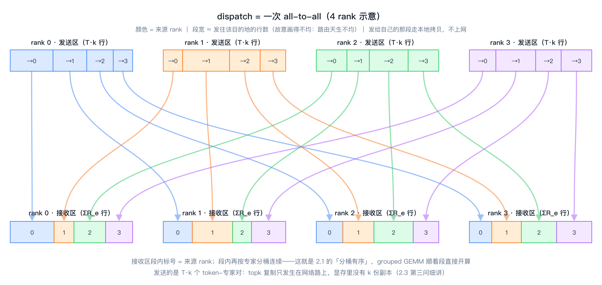

# 第二章｜经典结构：从 dispatch 到 combine，从前向到反向

> **入门主线 · 基础篇 2/3** ｜ [返回目录](../README.md)

上一章主要直观地讲了一下什么是 Mega-MoE 大算子。简单说来，MoE 是稀疏化的线性层，而 Mega-MoE 是把 MoE 的计算操作和通信操作集成到单一算子中的大算子，是一种性能优化方法。

而本章专注于 Mega-MoE 经典结构中各个子模块的作用，以及相互之间的数据依赖关系。这一章的内容事实上是简单的、基础的，但我仍然建议各位读者耐心读完——只有弄清楚哪一步在计算、哪一步在通信，到第三章我细细讲解"计算-通信掩盖"这门最核心的手艺时，你才能品出它的妙用。

## 2.1 前向一条线：形状账

设每 rank 有 T 个 token，hidden 维 H，专家 FFN 中间维 F，本 rank 拥有 E_r 个专家（EP 切分）。一轮前向的矩阵形状账（第一遍读可以只看 ①–⑥ 的动词，方括号里的形状第二遍再对）：


*主线画出来就是这条链：x 经 router 吐出专家号和门控权重，排序对齐后 dispatch 发往各 rank，FC1 → 加权 SwiGLU → FC2，最后 combine 按原路发回、topk 归约出 out——下面的 ①–⑥ 每一步都能在图里对上号；红虚线圈住的两处融合域（dispatch+FC1、FC2+combine+归约）为什么这么焊，第三章细讲。*


```text
x [T, H]
  │  router（库外）：selected_experts [T,k] int32 + routing_weights [T,k] fp32
  ▼
① 排序对齐：按 (目的rank, 专家) 稳定排序，算出每桶的发送/接收偏移
  ▼
② dispatch（A2A）：把 token 行发往专家所在的 rank
     本 rank 收到 ΣR_e 行（R_e = 专家 e 实际收到的行数；负载均分时 Σe R_e ≈ T·k，全网合计 world·T·k）
     → X_e [R_e, H]
  ▼
③ FC1 grouped GEMM：Y_e = X_e @ W1_eᵀ      W1 打包 [E_r, H, 2F]
     → Y_e [R_e, 2F]（前半 gate，后半 up）
  ▼
④ 加权 SwiGLU：A_e = ( silu(Y_gate) ⊙ Y_up ) × 门控权重
     → A_e [R_e, F]
  ▼
⑤ FC2 grouped GEMM：Z_e = A_e @ W2_eᵀ      W2 [E_r, H, F]
     → Z_e [R_e, H]
  ▼
⑥ combine（反向 A2A）：Z 行按原路发回出发 rank，按 top-k 槽位加权求和
     → out [T, H]
```

补一个形状账里画不出来的约束——**capacity（容量）**：第一章 config 里那个 capacity_factor（1.25 / 4.0）说的就是它。经典 MoE 系统给每个专家的接收区预留固定行数上限 = 平均行数 × capacity_factor，路由超出的 token 直接丢弃（drop），不足的补零（pad）——用计算正确性上的一点让步，换内存和流水的可控。本教程的配置把容量开得足够大（不 drop），所以后文一律按实际行数 R_e 来写。

留个伏笔：dropless 之后 capacity_factor 并没有失业，而是**换了一份工作**——从"丢 token 的阈值"变成"对称接收区的尺寸"。又因为对称内存要求全员同尺寸，它本质上是一笔按最坏倾斜买的 HBM 预算：买多大、默认为什么开到 world_size、赌错了谁来兜底，这笔账放到第四章 4.6 节专门算。

前向计算的核心就是这一条线，接下来依次讲每一步是怎么算的。

## 2.2 router 是怎么工作的

虽然 router 部分并不在大算子里，但它值得单独停一秒再看：**这一步判决，决定了后面所有数据怎么流**。

router 本身不复杂，三步：一个小 GEMM 算亲和度，一个 top-k 挑专家，再把选中的 k 个权重归一：

```python
# tests/_moe_baselines.py:66-69（摘，golden 的参考 router）
logits = hs.float() @ gw.float().T                   # ① 亲和度：[T, H] @ [H, E] → [T, E]
rw = torch.softmax(logits, dim=-1).to(dtype)         # ② softmax 归一成概率
topk_w, topk_idx = torch.topk(rw, topk, dim=-1)      # ③ 每个 token 挑 k 个专家
topk_w = topk_w / topk_w.sum(dim=-1, keepdim=True)   # ④ 选中集内再归一，Σw = 1
```

因此它的关键产物就是两个小张量：`selected_experts [T,k]`（专家号）和 `routing_weights [T,k]`（门控权重）。库从这里接手，2.1 形状账里 ①"排序对齐"干的事，就是照着这份判决单给每个 token 安排新住址。

那为什么 router 放在 Mega-MoE 之外？三个理由。其一，油水不大：一次 `[T,H] @ [H,E]` 的小 GEMM 加一个 topk，占整层的开销连零头都算不上，融不融合不疼不痒。其二，**门控权重是要训练的**——router 必须留在框架的 autograd 图里，梯度才能顺着链式法则流回去（反向那一侧，对门控权重的梯度会单独结算，见 2.8 的"外加：gate 梯度"）。其三，路由策略五花八门——softmax 还是 sigmoid、要不要 aux loss 修负载均衡、要不要 drop/pad——**库只认"专家号 + 权重"这对输入，谁来对接都行**。

最后留个伏笔：top-k 选完的那一瞬间，"哪个 token 去哪张卡"就已经定了。后面 dispatch 的一切复杂度（直方图、permute、A2A）都是在执行这份判决；而负载不均的祸根，也埋在这里——第七章 MoonEP 能够从一定角度去拆这个雷。

## 2.3 dispatch 的细账：permute、直方图、topk 复制

形状账里的①"排序对齐"四个字，落到实现上是三个绕不开的问题：为什么必须 permute？经典做法怎么发（直方图 + 计数交换）？Mega-MoE 又怎么用对称内存把这套机制和 topk 复制省掉的？本节一次讲清。



*先把 dispatch 的真身画出来——一次 all-to-all：每个 rank 把 T·k 个 token-专家对按目的 rank 切成 4 段发出去（颜色 = 来源 rank，段宽 ≈ 行数，故意画得不均——路由天生不均），网络交叉之后，每个 rank 的接收区恰好拼回一道四色彩虹：按来源 rank 分段、段内按专家分桶连续——这就是形状账 ①② 要保的"分桶有序"。两个细节记住：发给自己的那段走本地拷贝、不上网；topk 复制只发生在网络路上，显存里没有 k 份副本（下面第三问细讲）。*

**第一问：为什么必须 permute？** grouped GEMM 有个入场要求：**同一个专家的行必须连续**。router 吐出来的是 `[T,k]` 的专家号，token 行还按原顺序躺在 x 里——同一个专家的行东一行西一行。所谓 permute（重排），就是以 `(目的rank, 专家)` 为键，给每行算一个"分桶连续"的新住址。为什么要这样排？因为 GEMM 计算通常是一个专家一个专家进行的，让同一专家的数据排在一起，数据访问才快（这就是存储的局部性原理）。代价是什么？permute 本身是一次复杂的离散访存排序，很花时间——这笔账第六章讲 NPU 亲和设计时还会回来算。

**第二问：经典做法怎么发？直方图 + 计数交换 + 物理复制。** 一轮 dispatch 每步都是框架现成算子：

```python
# src/mega_moe/ops/_torch_forward.py:238-267（摘，golden 经典路径）
expanded_hidden = hidden_states.repeat_interleave(topk, dim=0)  # ① topk 复制：[T,H] → [T*k,H]
send_counts = torch.bincount(expert_ranks, ...)                 # ② 直方图：每个目的 rank 几行
dist.all_to_all_single(recv_counts, send_counts, ...)           # ③ 交换计数：一次框架级集合通信
sort_idxs = torch.argsort(expert_ranks, stable=True)            # ④ permute 之排序
sorted_hidden = expanded_hidden[sort_idxs]                      # ⑤ permute 之 gather：物理副本
tokens_recv = _a2a(sorted_hidden, ...)                          # ⑥ 框架 A2A 发数据
weights_recv = _a2a(sorted_weights, ...)                        # ⑦ 权重还得单独发一遍
recv_hidden_sorted = tokens_recv[local_sort_idxs]               # ⑧ 收到后再按本地专家排一次
```

数一数拷贝：①复制 k 份、⑤gather 一份、⑥A2A 收一份、⑧再 gather 一份——**同一行 token 出厂前被完整搬了四次**；③是一次独立的集合通信；权重和专家号还要各跟一遍 A2A。每一步都合法，合起来就是第一章说的"小算子税"。

**第三问：对称内存怎么把这套机制省掉的？** 关键认知：③交换计数、④⑤⑧排序副本，目的都只有一个——**让收发双方对"接收区里谁放哪"达成一致**。而对称内存里全网共享同一块堆、同一种排布规则（第四章细讲），发端自己就能把对端的布局算出来，不需要"开会"：

```python
# src/mega_moe/runtime/routing.py:75-81（摘，路由元数据 kernel）
tl.store(local_row_ptr + bin_offs, local_counts)    # 直方图写进本 rank 的对称堆行
if sub_vec_id() == 0:
    for peer_rank in range(WORLD_SIZE):
        libshmem_device.putmem(local_row_ptr, ...)  # 顺手把这一行写进每个对端的对称堆
```

直方图还是要数（路由的数学，省不掉），但计数交换从框架级集合通信退化成 **kernel 内几 KB 的 putmem**。数据面更彻底：dispatch kernel 拿着行号表，从 x 的**原位置**直接读行、按算好的对端桶地址直接 put——没有 repeat_interleave、没有 sort 后的发送副本，**topk 复制只发生在网络路上（k 个专家确实各要一份），不再发生在显存里**——这个省法确实巧妙；门控权重在同一个 kernel 里走自己的对称通道捎过去。形状账 ①② 要求的"分桶有序"没有变——变的是达成它的代价。

## 2.4 一个矩阵是怎么算的

矩阵乘法是 Mega-MoE 的耗时大头——第一章算过，每 rank 每层约 2.2 TFLOP 里几乎全是 FC1、FC2 这两个 GEMM（激活那点亮元运算连零头都算不上）。这一节把这两个计算摊开解析。注意，它俩的计算方法还真不一样。

先看和普通 GEMM 有什么不同。dense FFN 层就是一个 `X @ W`；到了 MoE 这里变成 E_r 个"小 GEMM"：每个专家有自己的一份权重，收到的行数 R_e 还各不相同、要等路由完才知道。这种"一组权重各配一撮行、形状还都不一样"的 GEMM 家族，叫 **grouped GEMM（分组 GEMM）**。它的三个特点，全是从 2.1 的形状账里长出来的：

1. **权重按专家打包成表**：gate/up 两张矩阵打包成 `W1 [E_r, H, 2F]` 一张表——FC1 一次 GEMM 同时出 gate 和 up 两半（2.5 讲为什么需要两半）；down 投影是 `W2 [E_r, H, F]`。打包成表是为了按专家号直接索引整段权重，kernel 里不用临时拼。
2. **M 维是变的**：第 e 个 GEMM 的形状是 `[R_e, H] @ [H, 2F]`，R_e 是路由出来的，运行时才有数——kernel 拿着 ① 算好的桶偏移表，逐专家切片开算。这也是 ② 的接收区必须分桶连续的原因：不连续，GEMM 就没法整块整块地吃。
3. **两个 GEMM 的角色不对称**：FC1 是"扩维"（H → 2F，归约维 K=H），FC2 是"收回来"（F → H，归约维 K=F）。

"方法不同"还有第二层——两个 GEMM 在流水线里的站位不一样：FC1 紧跟 dispatch，是"先收后算"的 communicate-compute 算子；FC2 后面拖着 combine，是"先算后发"的 compute-communicate 算子（这套分类第三章 3.2 专门讲）。所以仓库里它俩分别和 dispatch、combine 焊成一个大 kernel（`dispatch_fc1`、`fc2_combine`），而不是两个独立的 GEMM 算子各算各的。GEMM 本体归 cube 引擎管，怎么和通信挤在同一个核里，是第三章的主戏。还有一件事后文要用到：**两个 GEMM 的计算量差一倍**——FC1 每专家约 2·R_e·H·2F，FC2 约 2·R_e·H·F（输出维 2F 对 F）。到第三章做通算掩盖分析时这个不对称很重要：两个算子的"影子"大小不同，各自能藏进去的通信量也不同。

## 2.5 激活函数在做什么工作

两个 GEMM 中间还夹着一步——激活。FC1 吐出来的 `[R_e, 2F]` 不能直接用，要过一道非线性。

**先说类型**。本仓库和主流大模型一样用 **SwiGLU**（门控线性单元的一种）。这就是为什么 FC1 要一次出 2F 维——前 F 维是 gate，后 F 维是 up：

```text
A_e = silu(Y_gate) ⊙ Y_up        其中 silu(x) = x · σ(x)
```

gate 那一路过 silu 非线性，再和 up 逐元素相乘——"门控"二字就来自这个乘法：gate 决定 up 的每个分量放多少过去。早年的 MoE 用 ReLU/GELU 这类无门控激活（FFN 只有两张矩阵）；SwiGLU 靠门控换来更强的表达能力，代价是多一张 up 矩阵——这正是第一章算权重账时"[3584, 3072] 的矩阵一共有 3 个"的原因。当然激活函数还有不少变体（GEGLU、带 clamp 的 SwiGLU 等），思想相通，用到再查不迟。

**再说作用**。一句话：注入非线性。没有它，FC1 和 FC2 两个线性变换叠起来还是线性，整个 FFN 等于白算。这是神经网络的老道理，不展开。

**从写算子的角度看，激活有两个脾气**，后面会反复用到：

1. **计算量极小，访存量不小**：逐元素操作，FLOP 是 O(R_e·F) 级别，比 GEMM 的 O(R_e·F·H) 小一个数量级；但它要完整读一遍 `[R_e, 2F]`、写一遍 `[R_e, F]`——典型的 memory-bound vector 活，归 vector 引擎管；
2. **精度要当心**：silu 里的 σ 在 bf16 下误差偏大，所以激活（连同顺手乘进去的门控权重 w_k，见 2.7）是在 FP32 里算完再降回 bf16 存出去的。

"计算量小 + 纯 vector"这两条凑在一起，让激活成了影子流水的最佳候选人——第三章 3.5 第四招，会把它整个塞进 FC2 的 cube 空闲窗口里跑。

## 2.6 combine 是一个什么样的操作

combine 是 dispatch 的镜像：dispatch 把 token 发给专家所在的卡，combine 把各专家算完的结果按原路发回出发的卡。前向的最后一步 ⑥ 就是它。拆开看，它是三件事：

- **通信上，还是一次 all-to-all**，只是方向反过来——每个 rank 把本地专家算出的 Z_e 行，按"这行当初是谁发来的"发回去。通信量和 dispatch 完全相等：第一章那笔 ~1 ms 的通信账，一半是 dispatch，另一半就花在这里；
- **计算上，带一个求和**：一个 token 去了 k 个专家，回来的是 k 条 `[H]` 行，要按 top-k 槽位加起来才还原出 `out [T, H]`（收尾 kernel `_kernel_local_topk_reduce`）。注意这里只剩**纯求和**——门控权重 w_k 已经在激活里乘掉了（2.7 马上讲），这是本仓库和经典实现的一个不同之处；
- **对称内存的红利照享**：和 dispatch 一样，发送端自己就算得出对端的接收布局，不需要框架级的计数交换（2.3 第三问）。

一句话：dispatch 和 combine 是同一台机器的正反两趟车。所以第三章讲掩盖时，它俩的手法也是镜像的——一个"边收边算"，一个"边算边发"。

## 2.7 topk 加权不一定要放在 combine 里

先回答一个问题：这个 topk 权重是哪来的？它就是 2.2 里 router 吐出的 `routing_weights [T,k]`——每个被选中的专家一份，选中集内 Σw = 1。直觉的设计是把它放在 combine：k 条行回来，各乘各的 w_k 再相加，`out = Σ_k w_k · z_k`。

但本仓库的做法有点反直觉：**加权不在 combine，被提前到激活了**。out = Σ_k w_k · FC2(act_k)，w_k 是标量、FC2 是线性的，所以 w_k 可以直接乘进 FC2 的输入。加权 SwiGLU 的文件头写得很直白：

那句 "route scaling" 就是这笔乘法：激活在 FP32 里顺手把 w_k 乘掉，FC2 照算，行回到出发 rank 时已经是带权的——所以收尾的 `_kernel_local_topk_reduce` 只做纯求和（`acc += values`，一行乘法都没有，`fc2_combine.py:479-495`）。**把加权提前、把求和留后**，一个不大的代数换位，换来 combine 侧少一遍加权访存。（反向正好对称：dy 是不带权来的，加权在最后的合并求和处补上——见 2.8 的 P4c。）顺带记一笔：这个"加权提前"的决定，到第八章讲反向重算设计时还有一次妙用。

## 2.8 反向：前向的影子过程

反向就是前向各模块的影子过程——比起前向，它多出两大一小的权重梯度计算（dW1、dW2 两个大 GEMM，外加一个小的 gate 梯度）。说概念，其实很简单；说工程，麻烦不少。

反向的输入是 `dy [T, H]`——下游传回来的输出梯度。照顾一下新人读者，先说一句梯度是怎么来的：训练的最后是一个损失函数 L，对 L 求导，得到的是最后一层输出的梯度；但网络有几十上百层，这份"责怪"怎么一层层往前传？靠链式法则——每一层收到下游传回来的"输出的梯度"，顺手做两件事：算出"输入的梯度"继续往上传，算出"权重的梯度"交给优化器。这个逐层回传的过程，就是反向传播。梯度的形状是随层变化的，传到我们这一层时，拿到的就是和前向输出同形的 `dy [T, H]`。

五个 mega-op 与数学阶段的一一对应：

```text
P1  dispatch-A2A（dy 也按前向同样的排列发过去） ∥ fc2 dgrad
P2  SwiGLU 反向（vector）
P3  fc2 wgrad（cube）
P4a fc1 dgrad → P4b reverse-A2A push ∥ P4c top-k 加权求和 → d_hidden
P5  fc1 wgrad
外加：gate 梯度（对门控权重的导数）
```

配上形状，和前向那张账对着看（注意 P1 直接复用前向算好的行号表——规划只做一次，前反向共享，反向不用再数一遍直方图）：

```text
dy [T, H]
  ▼
P1  dispatch_bwd（A2A，边收边算）→ dZ_e [R_e, H]
     ∥ fc2 dgrad：dA_e = dZ_e @ W2_e → [R_e, F]
  ▼
P2  SwiGLU 反向 → dY_e [R_e, 2F]     ∥ P3 fc2 wgrad：dW2_e = dZ_eᵀ @ A_e → [H, F]
  ▼
P4a fc1 dgrad：dX_e = dY_e @ W1_e → [R_e, H]
P4b reverse-A2A 发回 → P4c top-k 加权求和 → d_hidden [T, H]
P5  fc1 wgrad：dW1_e = dY_eᵀ @ X_e → [2F, H]（借 P4 的窗口跑，第三章 3.4）
```

对照前向形状账一眼就能看出"影子"二字的分量：链上每一步的形状都和前向镜像对称（[R_e, H] ↔ [R_e, 2F] ↔ [R_e, F] 倒着走一遍），但旁边多长出 P3、P5 两个 wgrad——下一节专门拆这两个多出来的 GEMM。


*把五个 mega-op 画成图：主线是 dispatch_bwd → FC2 → 激活 → FC1 → combine_bwd → 归约，沿路挂出三个绿色产物——dW2、dW1、dTopkWeight（它在 combine 合并现场顺手解出，host 再传回 router——见 2.10）；红虚线圈住的是仓库真正焊在一起的融合域，对应 2.10 那张依赖网上的可并行段。*

用公式写清楚（还是拿 FC1 说，`dY_e` 是 P2 的输出）：

- **dx1（dgrad，对输入的梯度）**：`dX_e = dY_e @ W1_e` → `[R_e, H]`。它的使命是**把误差继续传给上游**（attention 那边还等着它）。
- **dw1（wgrad，对权重的梯度）**：`dW1_e = dY_eᵀ @ X_e` → `[2F, H]`。它的使命是**交给优化器更新参数**。

## 2.9 dw1 和 dx1 到底差在哪

很多人第一次写 MoE 反向都在这里犯迷糊：**反向不就是前向倒过来吗？** 一半对，一半错。

**dx 确实是前向的镜像。** 前向 `Y = X @ W1ᵀ`，反向 `dX = dY @ W1`——用的是**同一份权重**，只是转置关系换个边，形状从 `[R,2F]→[R,H]` 变回去。上游拿到的梯度和前向输入同形，链式法则继续往前传。这就是"镜像"。

**dw 是前向的"影子"——一个前向里根本不存在的 GEMM。** 看清楚它的形状：`dYᵀ @ X`，两个操作数是**梯度和激活**，权重在这个式子里只是输出。更麻烦的有两点：

1. **归约维是 token**：该专家收到的所有 R_e 行，每一行都对 dW1 有贡献，必须全部累加进来。dx 是"一行进一行出"，dw 是"万行进一份出"——归约语义完全不同；
2. **布局是转置的**：`dYᵀ @ X` 自然产出 `[2F, H]`，而权重存储是 `[H, 2F]`（打包布局），中间要么转置权重要么转置梯度。这笔"回转置"账不小——bigop 基线里 fc2 wgrad 光回转置就花了 9.6 ms，比 GEMM 本体（3.98 ms）还贵；mega 路径把它设计掉了（无回转置，~4.5 ms）。

**所以为什么反向运算多？** 数一下：前向 2 个 GEMM（FC1、FC2），反向裂变成 4 个（2 个 dgrad + 2 个 wgrad）；再加 SwiGLU 的反向（闭式可导，不贵但要算）、gate 梯度、两次 A2A 的反向。粗算**反向计算量 ≈ 前向 × 2**，这是 MoE（一切带权层）的宿命，不是实现偷懒。（上文 bigop/mega 的毫秒数字为本仓库实测，测试配置与日期待补录。）

## 2.10 反向是"网"不是"链"——一个直接的代码证据

前向的六步是一条链（②依赖①，③依赖②……），所以能流水（第九章的主戏）。反向呢？看编排代码里这段注释，它把五个 op 的依赖关系说透了：

```python
# src/mega_moe/ops/backward.py:178-184（摘）
# P1 perf: run step3 (fc2 wgrad) and step5 (fc1 wgrad) on a SIDE STREAM so
# their cube GEMMs overlap with step2 (swiglu, vector) and step4 (combine,
# mostly vector push). Dependency: step3 needs only step1's grad_fc2_out_sorted;
# step5 needs only step2's grad_fc1_output — neither needs the prior wgrad nor
# step4 (verified against the golden's per-op deps).
```

画出来（这回把三个梯度产物也挂上）：

```text
step1 ──┬──► step2(swiglu, vector) ──┬──► step4(combine, vector) ──► d_hidden + dTopkWeight
        │                            │
        └──► step3(fc2 wgrad, cube)  └──► step5(fc1 wgrad, cube)
                    │                             │
                    ▼                             ▼
                   dW2                           dW1
```

顺便回答"topk 权重梯度（dTopkWeight）挂在哪"：它挂在 **step4** 上——gate 梯度在 combine 合并现场从 packed gate channel 里顺手解出来（`combine_fc1_bwd.py:360-365`），和 d_hidden 一起作为 step4 的产物返回，host 拿到后再沿 router 的 softmax 链式传回去（呼应 2.2：router 留在 autograd 图里，等的就是这份梯度）。所以它不占额外的 mega-op——在依赖网里它不是新节点，是 step4 多结的一颗果子。

P1 的输出同时喂 P2 和 P3；P5 等 P2 但不等 P4——**扇出和汇合都出现了，这是网，不是链**。记住这个形状，第九章讲"为什么反向做不了前向那种全局流水"时，答案的种子已经埋在这里。

## 2.11 小结

前向一条链：router 库外出判决（2.2）→ 排序 + dispatch（2.3：permute 是 grouped GEMM 的入场费，经典路径用"直方图 + 计数交换 + 四次拷贝"付账，对称内存把它换成 kernel 内一次 putmem，topk 复制只走网络不占显存）→ 两个 grouped GEMM 夹一个 SwiGLU（2.4、2.5）→ combine 发回求和（2.6），而 topk 加权提前到了激活里，combine 只剩纯求和（2.7）。反向 = 五 op 一张网（2.8–2.10），每个 GEMM 裂成 dgrad（镜像，传给上游）和 wgrad（影子，交给优化器，归约维是 token 还要转置布局）。**结构清楚了，下一章上真代码，看这条链在 NPU 上怎么被流水线盖住。**

---

← [上一章](01-what-is-moe.md) ｜ [返回目录](../README.md) ｜ [下一章：通信与计算掩盖的艺术](03-mega-moe-td-walkthrough.md) →
