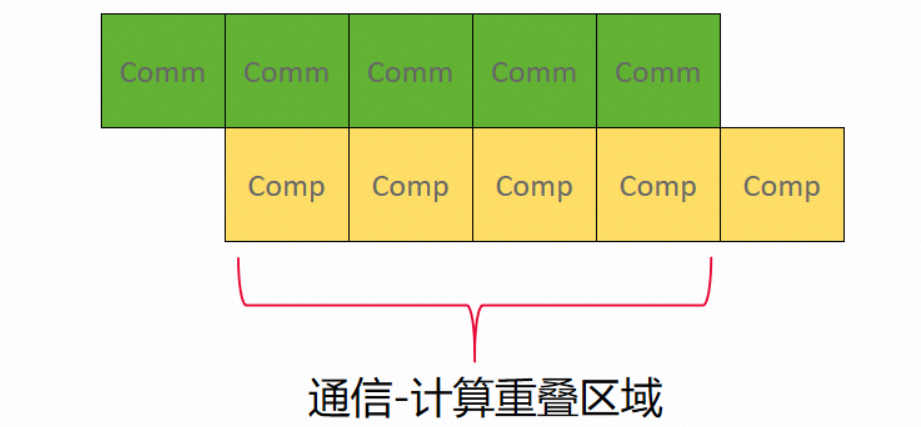
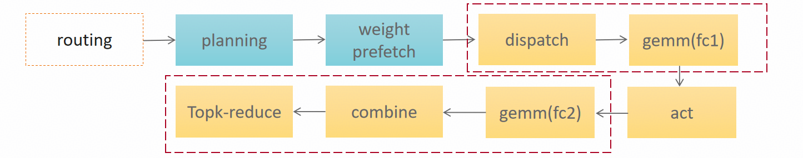

# 第三章｜通信与计算掩盖的艺术

> **入门主线 · 基础篇 3/3** ｜ [返回目录](../README.md)

**一句话：掩盖的核心手法就五招——引擎分工、细粒度信号、双 buffer、影子流水、尾部填充；前向用它们盖出"边收边算"，反向用它们盖出"段内并行"。**

## 3.1 到底什么是通信，到底什么是计算

megamoe的通信与计算是怎么来的。



*两条道：上面是通信（Comm），下面是计算（Comp），各切成五块。不重叠时老老实实排两队，总时长是两串之和；分块之后通信填进计算的空隙，只剩开头的填充（fill）和结尾的排空（drain）暴露在外面——红框括住的那段，就是"通信藏在计算影子里"的重叠区。这也是 megamoe 一切掩盖手法的出发点。*


## 3.2 前向算子拆解：先把最基本的问题问完

串行分析法：如何分析是通信bound,还是计算bound两者的理论值是多少。

## 3.2 前向算子拆解：先把最基本的问题问完

讲"掩盖"之前，先把最基本的问题答了：**这层到底被切成了哪几个算子？每个吃什么、吐什么？** 多 kernel 路径下，前向 = 一个规划 + 两个大 kernel + 一个收尾 kernel：

```text
build_routing_plan（runtime/routing.py，host 侧规划）
    吃：selected_experts [T,k] + routing_weights [T,k]（router 在库外算好）
    吐：行号表 + 每桶偏移——"谁的第几行、发去哪个桶"（就是 2.2 的对称内存省法）

_kernel_dispatch_fc1（kernels/dispatch_fc1.py:49）
    吃：x [T,H] + 行号表 + W1 [E_r,H,2F]
    吐：fc1_output [ΣR_e, 2F]（接收区按 (源rank, 专家) 桶连续排布）

_kernel_fc2_combine（kernels/fc2_combine.py）
    吃：fc1_output + W2 [E_r,H,F]
    干：加权激活（藏在 FC2 影子里）+ FC2 GEMM + 结果回传 push

_kernel_local_topk_reduce（fc2_combine.py:450）
    吃：回到本 rank 的 k 条行
    吐：out [T,H]（纯求和——加权已在激活处乘掉，见 2.2）
```



*上面这份清单画成图：路由 → 规划 → 权重预取 → dispatch → FC1 → 加权激活 → FC2 → combine → top-k 归约；红虚线圈住的两处（dispatch+FC1、FC2+combine+归约）就是仓库真正焊在一起的融合域——本章接下来讲它们里面长什么样。*

单 kernel 路径（`enable_single_kernel_forward=True`）把这串焊成一次 launch（第九章展开）；反向同理是五个 mega-op（第二章 2.3）。

**第一个精华在 `_kernel_dispatch_fc1`：dispatch 与 FC1 的"边收边算"。** 它在同一个物理 AI Core 上拆出两条指令流——vector 搬 token + 发就绪信号，cube 做分组 GEMM。先看伪代码，全部逻辑就这两段：

```text
vector 侧（搬运工）——对本 rank 要发的每个 tile（128 行）：
    把 tile 从 x 的原位置读出，写进目的 rank 接收区对应的桶
    往"这个 tile 专属的信箱"塞一张到货单（写明第几轮）

cube 侧（计算工）——对每个专家的每个 tile：
    查信箱：只等自己马上要消费的那几个 tile
    齐一块算一块：FC1 GEMM 不等全量数据到齐
```

再上真实代码对照（语法细节第四章逐行拆，这里只需要认出角色）：

```python
# src/mega_moe/kernels/dispatch_fc1.py:406-477（摘）
signal_slot = (
    (LOCAL_RANK * EXPERTS_PER_RANK + expert_id) * MAX_SOURCE_TILES
    + source_tile
)   # ↑ 信箱编号：每个（源rank × 专家 × tile）三元组一个专属信箱，全网不重号
if DIRECT_REMOTE_STORE:
    remote_input_ptr = dl.symm_at(peer_mem_ptr, dst_rank)  # 对端接收区地址（对称堆直接算出）
    ...                                                     # 按 tile 掩码搬数据（第四章）
    libshmem_device.fence()                               # 第一步：先保证数据落地
    libshmem_device.signal_op(                            # 第二步：再发到货通知
        signal_mem_ptr + signal_slot * 16,                # 信箱实体：每槽 16 个 int32（ABI 约定，第四章）
        signal_epoch,                                     # 通知内容："第几轮"——单调递增，防上一轮残影
        libshmem_device.ACLSHMEM_SIGNAL_SET,
        dst_rank,
    )
```

读法就三句：①每发完一个 128 行的 tile，就往它专属的信箱 SET 一个届号；②消费侧（cube 的 GEMM）不等全量，只 `dl.wait` 自己马上要用的那几个 tile；③于是"专家 3 的第 7 个 tile 到齐 → FC1 立刻开算"，不用等专家 11 的数据——**生产者-消费者的细粒度握手，这就是"掩盖"两个字的物理实现。**

## 3.3 掩盖手法清单

**第一招：引擎分工（vector/cube 各干各的）。** 昇腾的一个 AI Core 里有 cube（矩阵引擎）和 vector（向量引擎）两条指令流。MoE 一层里，GEMM 归 cube，搬运/逐元素/通信原语归 vector。

**软件流不是引擎流**：把 wgrad 放到旁路软件 stream 上，实测慢 12.5 倍（112→1402 ms）。真正的 cube/vector 重叠必须发生在一个 kernel 内部（`al.scope(core_mode=...)`，第六章细讲）。这个教训的价值在于它告诉你：**掩盖不是"并行"两个字，是"让真正空闲的硬件干活"。**

**第二招：细粒度信号替代粗粒度 barrier。** 上一节的 per-tile SET/wait 就是。全局 barrier 是"全楼开会等人到齐"，细粒度信号是"各工位自己的料到了就开工"。前者让最慢的人决定一切，后者让流水真正流动。

**第三招：双 buffer。** 计算和搬运交替使用两块缓冲，读写永不碰头。看 tile 常量前，先认四个片上仓库：**UB**（统一缓冲，vector 侧的大粮仓）、**L0A/L0B**（cube 引擎的 A/B 矩阵缓存）、**L0C**（cube 的累加器）。下面这段 tile 参数注释，每一条都是"哪个仓库喂饱了、哪个爆了"的账：

```python
# src/mega_moe/kernels/common.py:24-33（摘）
BLOCK_SIZE_M = 64    # 与前向元数据 tiling 锁死一致，step1/step4 共享
BLOCK_SIZE_N = 128
BLOCK_SIZE_K = 256   # K=256 的 [256,128] bf16 b-tile 正好填满 L0B（64KB）
# M=128 试过：[128,256]+[256,128] 双缓冲 = 256KB > 192KB UB，爆了，净变慢
WGRAD_BLOCK_M = 256  # wgrad 的归约维（token），BM=256 填满 L0A/L0C；
                     # GPU 上的 BM=64 让 L0A 只有 1/4 满，cube 饿死（MTE-bound）
```

每一条 tile 选择背后都是"哪个片上存储喂饱了、哪个爆了"的账。**调 kernel 不是玄学，是记账。**

**第四招：影子流水。** 激活（加权 SwiGLU）是纯 vector 活，而 FC2 阶段 cube 在忙 GEMM——那就把激活塞进 FC2 的空闲 vector 资源里跑（`_fc2_combine_shadow_activation`，"shadows weighted activation under FC2"，见第一章 docstring）。空闲资源不是等出来的，是找出来填满的。

**第五招：尾部填充。** 反向的 step5（fc1 wgrad）不独立排队，而是挂到 step4 combine 的 **cube 流尾**（`cube_tail` 回调）——step4 的 vector 侧在忙 push，cube 侧正好空着，wgrad 借这个窗口跑完大半。

## 3.4 后向基本算子的掩盖

把五 op 放到引擎上（`MOE_BWD_MEGA=1` 时融成一个 launch，相位用 kernel 内 barrier 分隔）：

```text
P1  dispatch-A2A(vector) ∥ fc2 dgrad(cube)          ← 边收边算，前向同款
B1  ─── barrier_all ───
P2  swiglu 反向(vector)   ∥   P3 fc2 wgrad(cube)     ← 第二招+第一招
B2  ─── barrier_all ───
P4a fc1 dgrad(cube)
B3  ─── barrier_all ───
P4b 反向 A2A push(vector) ∥   P5a fc1 wgrad 前半(cube)  ← 第五招：P5 藏进 push 窗口
B4  ─── barrier_all ───
P4c top-k 加权求和(vector) ∥   P5b fc1 wgrad 后半(cube)
```

对照第二章的依赖网看：**网虽然不能变成流水线，但网的每一段内部都被塞满了。** P2/P3 引擎分工、P4b/P5a 借窗口、P4c/P5b 收尾并行——这就是反向在"网"的约束下能拿到的近似最优。

## 3.5 实战笔记：怎么证明"掩盖"真的发生了

（性能方法学·上）调掩盖最忌"我觉得快了"。三条铁律：

1. **先对数，再计时。** 任何优化前后都要和 torch golden 比数值（布局量精确相等、梯度容差 ~2e-2），错了的快是废快；
2. **报 median，不报 mean；多卡取 rank-MAX。** 一个毛刺就能污染 mean；多卡同步场景下，最慢的卡才是你真正的速度；
3. **计时协议固定**：warmup 若干轮再测、NPU 事件钟或墙钟选一个并写明。协议不一样，数字不可比。

第九章会讲进阶版：怎么在 kernel 内部打相位点，把"哪一段在等"拍成 X 光片。

## 3.6 换一块芯片，这些手法还在吗？（移植者对照表）

（给第二类读者）本章五招加上第六章的亲和手法，哪些是昇腾特产、哪些放之四海皆准：

| 手法 | GPU 上的对应物 | 通用度 |
|---|---|---|
| 引擎分工（cv 融合） | SM 分组：一部分跑 NVSHMEM 通信、一部分跑 GEMM（UniEP 路线） | 思想通用，形态平台特有 |
| 细粒度信号（per-tile SET/wait） | NVSHMEM 的 put + signal + 到达计数 | 完全通用 |
| epoch 单调届号 | 任何持久信号槽都有"残影"问题，NVSHMEM 同款解法 | 完全通用 |
| 双 buffer | 双缓冲寄存器轮转 / TMA 多级流水 | 完全通用 |
| 影子流水 | epilogue 融合、warp specialization 填空闲 | 思想通用 |
| 尾部填充 | persistent kernel 尾部接活 | 思想通用 |
| 分桶有序（排序对齐） | vLLM `moe_align_block_size` 做的就是这件事 | 完全通用 |
| 布局先行免 gather | TMA 对 contiguous/对齐的同款偏好 | 完全通用 |

一句话：**平台会换，"让数据连续、让同步变细、让空闲引擎干活"不换。**

## 3.7 开发者注记（源码与开关入口）

（给第三类读者）验证与复现本章内容的入口：

- 正确性：`tests/layer/test_moe_suite.py`（triton 路径 vs torch golden vs bigop 三方对数）；
- 性能：`benchmark/layer/bench_moe_suite.py`（median + rank-MAX 协议，见 3.5）；
- 反向单 launch：`MOE_BWD_MEGA=1`；`MOE_WGRAD_STREAM=1` 是反面教材（3.3 的 12.5× 教训，别开）。

## 3.8 小结

五招手法：引擎分工、细粒度信号、双 buffer、影子流水、尾部填充。前向把它们组合成"边收边算"，反向组合成"段内塞满"。**核里这两条指令流怎么互相打招呼、跨 rank 的货到了怎么通知？下一章拆通信原语 signal / wait / epoch；NPU 和 GPU 的架构差异，第六章再抬头看。**

---

← [上一章](02-dispatch-to-combine.md) ｜ [返回目录](../README.md) ｜ [下一章：通信原语](04-comm-primitives.md) →
