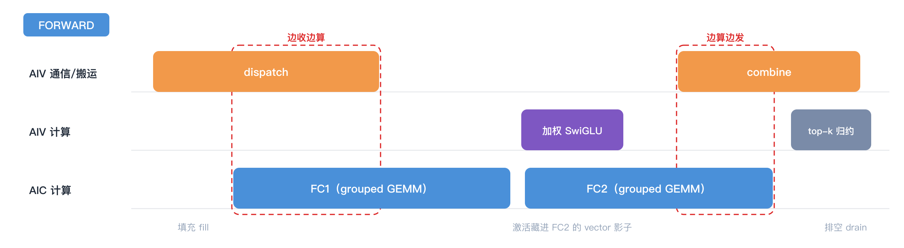
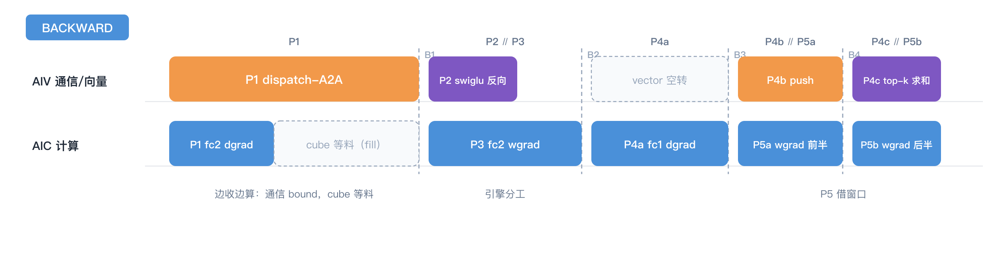

# 第三章｜通信与计算掩盖的艺术

> **入门主线 · 基础篇 3/3** ｜ [返回目录](../README.md)

这一章是全书最核心的一部分。展开的路线是这样的：先从理论出发，拆解两类关键的通算算子——communicate-compute 算子（先收后算）和 compute-communicate 算子（先算后发），并建立分析掩盖流水的基本方法；再拿着这套方法把 MoE 的前向、反向逐段拆解，看每个算子吃什么、吐什么，真代码怎么排；然后把这些做法收拢成一张掩盖手法清单；最后解决一个工程问题：怎么用实测数字证明"掩盖"真的发生了。

## 3.1 到底什么是通信，到底什么是计算

先把两个主角从第一章的账里领出来：**通信**，就是 dispatch 和 combine 那两次 all-to-all——数据从一张卡搬到另一张卡；**计算**，就是 FC1/FC2 两个 grouped GEMM 加中间的激活——在张量上做乘加。Mega-MoE 的通信与计算，账面上就这两样。换个角度看，这俩是典型的生产者-消费者模型：通信生产要算的数据，计算把它消费消化掉。

它们凭什么能重叠？两个前提缺一不可：

- **软件上能分片**：数据能切成 tile 一块一块地走，不用等全量到齐——吃第一块蛋糕的时候，第二块正在送来的路上，两者并行；
- **硬件上有两份搬运单元和配套的两份存储单元**：就像一个人用两只手拿盒子里的蛋糕，左一块、右一块，交叉往嘴里送——左右手就是两份搬运单元，盒子就是存储单元。

把这两条画成图，就是一切掩盖手法的总模型：


*两条道：上面是通信（Comm），下面是计算（Comp），各切成五块。不重叠时老老实实排两队，总时长是两串之和；分块之后通信填进计算的空隙，只剩开头的填充（fill）和结尾的排空（drain）暴露在外面——红框括住的那段，就是"通信藏在计算影子里"的重叠区。这也是 Mega-MoE 一切掩盖手法的出发点。*

## 3.2 串行分析法：先算清是通信 bound 还是计算 bound

讲手法之前，先把"怎么分析"立起来。MoE 整条链上真正值得融合的，其实是两类"通算算子"：

- **communicate-compute 算子（先收后算）**：dispatch + FC1 是代表——token 从网上收到一块，GEMM 就能算一块。通信是生产者，计算是消费者，掩盖的方向是"边收边算"；
- **compute-communicate 算子（先算后发）**：FC2 + combine 是代表——结果算完一块，就往回发一块。计算是生产者，通信是消费者，掩盖的方向是"边算边发"。

整层 MoE 就是这两类算子首尾相接，中间夹一个纯计算的激活（它最终被塞进 FC2 的影子里，3.5 再讲）；反向同理——P1 是先收后算，P4 是先算后发。

分析任何一个通算算子，用的都是同一套**串行分析法**。讲方法之前，先看一眼理论上限在哪——串行执行时，总时长是两者相加；理想掩盖之后，总时长逼近两者中的大者：

`T_serial = T_comm + T_comp`　→　`T_ideal ≈ max(T_comm, T_comp)`

（严格说还要加上 3.1 图里红框外的那两小截：开头的填充和结尾的排空。）

这个公式值得多读几遍，它有三层含义：

1. **最好的状态，是一个把另一个整个盖住**——T_ideal 里只留下大头的名字，小头全部藏进影子；
2. **掩盖收益的上限是 min(T_comm, T_comp)，两者相等时达到最大**——T_serial − T_ideal = min(T_comm, T_comp)，串行总量不变的前提下，两侧越接近，能省出来的越多；
3. **一侧明显大的时候，先别抠掩盖**——min 被小头卡死，流水排得再细也省不了多少。这时该做的是先优化大头：通信大就降通信量、提带宽，计算大就提算力、减计算，把两侧拉回同一量级，再回来抠掩盖。如此循环，就是本章后面所有手法的总节奏。

落到操作上，串行分析法就三步：

1. **切粒度**：把两边都切到可掩盖的最小单位（一个 128 行的 tile、一段 K 维切片）。粒度越细，可填的缝越多，但同步开销也越大——切多细是个要实测的权衡；
2. **各算理论值**：T_comm = 通信字节数 ÷ 有效带宽，T_comp = FLOP 数 ÷ 实际算力。注意都是"有效"——链路标称 500 GB/s，集合通信能吃满七成就该谢天谢地了；
3. **比大小、定 bound**：T_comm > T_comp 是通信 bound，让计算藏进通信的缝里；反之是计算 bound，让通信藏进计算的影子里。对照上面的上限公式，这一刀下去最多能省多少，心里就有数了。

## 3.3 前向算子拆解：先把最基本的问题问完

好了，上一节讲的是怎么在理论上给通算算子算账，这一节来看实操。

先把最基本的问题答了：**这层到底被切成了哪几个算子？每个吃什么、吐什么？** 多 kernel 路径下，前向 = 一个规划 + 两个大 kernel + 一个收尾 kernel：

```text
build_routing_plan（runtime/routing.py，host 侧规划）
    吃：selected_experts [T,k] + routing_weights [T,k]（router 在库外算好）
    吐：行号表 + 每桶偏移——"谁的第几行、发去哪个桶"（就是 2.3 的对称内存省法）

_kernel_dispatch_fc1（kernels/dispatch_fc1.py:49）
    吃：x [T,H] + 行号表 + W1 [E_r,H,2F]
    吐：fc1_output [ΣR_e, 2F]（接收区按 (源rank, 专家) 桶连续排布）

_kernel_fc2_combine（kernels/fc2_combine.py）
    吃：fc1_output + W2 [E_r,H,F]
    干：加权激活（藏在 FC2 影子里）+ FC2 GEMM + 结果回传 push

_kernel_local_topk_reduce（fc2_combine.py:450）
    吃：回到本 rank 的 k 条行
    吐：out [T,H]（纯求和——加权已在激活处乘掉，见 2.7）
```


*上面这份清单画成图：路由判决 → 排序规划 → dispatch → FC1 → 加权激活 → FC2 → combine → top-k 归约；红虚线圈住的两处（dispatch+FC1、FC2+combine+归约）就是仓库真正焊在一起的融合域——本章接下来讲它们里面长什么样。*

单 kernel 路径（`enable_single_kernel_forward=True`）把这串焊成一次 launch（第九章展开）；反向同理是五个 mega-op（第二章 2.8）。

**第一个精华在 `_kernel_dispatch_fc1`：dispatch 与 FC1 的"边收边算"。** 它在同一个物理 AI Core 上拆出两条指令流——vector 搬 token + 发就绪信号，cube 做分组 GEMM。先看伪代码，全部逻辑就这两段：

```text
vector 侧（搬运工）——对本 rank 要发的每个 tile（128 行）：
    把 tile 从 x 的原位置读出，写进目的 rank 接收区对应的桶
    往"这个 tile 专属的信箱"塞一张到货单（写明第几轮）

cube 侧（计算工）——任务按（专家 × N 维 tile）派给各个 cube 核：
    对每个专家的每个 M 窗口：
        查信箱：算出这个窗口跨哪几个源 rank 的哪几个 tile，只等这几个
        等到就开工：A/B tile 沿 K 维循环乘加（L0A/L0B 喂 cube、L0C 攒结果）
        写出到 fc1_output 对应的桶位——全程不等全量数据到齐
```

再上真实代码对照。先看 vector 搬运工（语法细节第四章逐行拆，这里只需要认出角色）：

```python
# src/mega_moe/kernels/dispatch_fc1.py:406-477（摘）
signal_slot = (
    (LOCAL_RANK * EXPERTS_PER_RANK + expert_id) * MAX_SOURCE_TILES
    + source_tile
)   # ↑ 信箱编号：每个（源rank × 专家 × tile）三元组一个专属信箱，全网不重号
if DIRECT_REMOTE_STORE:
    remote_input_ptr = dl.symm_at(peer_mem_ptr, dst_rank)  # 对端接收区地址（对称堆直接算出）
    ...                                                     # 按 tile 掩码搬数据（第四章）
    libshmem_device.fence()                               # 第一步：先保证数据落地
    libshmem_device.signal_op(                            # 第二步：再发到货通知
        signal_mem_ptr + signal_slot * 16,                # 信箱实体：每槽 16 个 int32（ABI 约定，第四章）
        signal_epoch,                                     # 通知内容："第几轮"——单调递增，防上一轮残影
        libshmem_device.ACLSHMEM_SIGNAL_SET,
        dst_rank,
    )
```

再看 cube 计算工——它对同一片接收区做分组 GEMM，核心结构也是三步：派任务、查信箱、齐一块算一块：

```python
# src/mega_moe/kernels/dispatch_fc1.py:614-688（摘）
for task_id in range(pid + first_task, last_task, ncore):  # 任务按（专家 × N 维 tile）派给各 cube 核
    expert_id = task_id // num_n_tiles
    n_tile = task_id % num_n_tiles
    ...
    for m_window in range(0, num_m_windows):               # 该专家的每个 M 窗口
        for source_id in range(0, WORLD_SIZE):             # 窗口跨哪几个源 rank？逐个查
            ...
            if overlap_start < overlap_end:                # 行号有交集的 tile 才需要等
                token = dl.wait(                           # 只等这几个 tile 的届号（acquire 语义）
                    signal_mem_ptr + signal_slot * 16,
                    last_source_tile - first_source_tile + 1,
                    "gpu", "acquire",
                    waitValue=signal_epoch,
                )
                ready_token += token
        ready_input_ptr = dl.consume_token(input_ptr, ready_token)  # 票齐了，接手数据指针
        _triton_grouped_gemm_one_mn_tile_tail(...)         # K 维循环 acc += tl.dot(a, b)，写出到桶位
```

读法就三句：①每发完一个 128 行的 tile，就往它专属的信箱 SET 一个届号；②消费侧（cube 的 GEMM）不等全量，只 `dl.wait` 自己马上要用的那几个 tile；③于是"专家 3 的第 7 个 tile 到齐 → FC1 立刻开算"，不用等专家 11 的数据——**生产者-消费者的细粒度握手，这就是"掩盖"两个字的物理实现。**



*把前向的 kernel 放上三条车道（模块粒度，不画 tile）：dispatch 还没发完 FC1 就开算（红框：边收边算），加权激活整个藏进 FC2 的 vector 影子，FC2 还没算完 combine 已经开始往回发（红框：边算边发），top-k 归约收尾。两头露在外面的填充和排空，就是 3.1 图里红框外的那两小截。第九章的单 kernel 波流水是这张图的"加密版"——同三条车道，模块切得更细、跑得更快。*

## 3.4 反向基本算子的掩盖

把五 op 放到引擎上（`MOE_BWD_MEGA=1` 时融成一个 launch，相位用 kernel 内 barrier 分隔）：



*五相位放上两条引擎车道：P1 是和前向同款的边收边算——只是这段通信是大头，cube 算完自己那份只能等料（3.6 会算这笔账）；P2∥P3 引擎分工（3.5 第一、二招）；P4b∥P5a、P4c∥P5b 把 fc1 wgrad 拆成两半，借 push 和归约的窗跑（3.5 第五招）；B1–B4 是 kernel 内 barrier，相位之间全场等齐。*

对照第二章的依赖网看：**网虽然不能变成流水线，但网的每一段内部都被塞满了。** P2/P3 引擎分工、P4b/P5a 借窗口、P4c/P5b 收尾并行——这就是反向在"网"的约束下能拿到的近似最优。这些做法在下一节逐条收拢。

## 3.5 掩盖手法清单

前两节在前向和反向里见过的做法，收拢起来是五招：

**第一招：引擎分工（vector/cube 各干各的）。** 昇腾的一个 AI Core 里有 cube（矩阵引擎）和 vector（向量引擎）两条指令流。MoE 一层里，GEMM 归 cube，搬运/逐元素/通信原语归 vector。

**软件流不是引擎流**：把 wgrad 放到旁路软件 stream 上，实测慢 12.5 倍（112→1402 ms）。真正的 cube/vector 重叠必须发生在一个 kernel 内部（`al.scope(core_mode=...)`，第六章细讲）。这个教训的价值在于它告诉你：**掩盖不是"并行"两个字，是"让真正空闲的硬件干活"。**

**第二招：细粒度信号替代粗粒度 barrier。** 3.3 的 per-tile SET/wait 就是。全局 barrier 是"全楼开会等人到齐"，细粒度信号是"各工位自己的料到了就开工"。前者让最慢的人决定一切，后者让流水真正流动。

**第三招：双 buffer。** 计算和搬运交替使用两块缓冲，读写永不碰头。看 tile 常量前，先认四个片上仓库：**UB**（统一缓冲，vector 侧的大粮仓）、**L0A/L0B**（cube 引擎的 A/B 矩阵缓存）、**L0C**（cube 的累加器）。下面这段 tile 参数注释，每一条都是"哪个仓库喂饱了、哪个爆了"的账：

```python
# src/mega_moe/kernels/common.py:24-33（摘）
BLOCK_SIZE_M = 64    # 与前向元数据 tiling 锁死一致，step1/step4 共享
BLOCK_SIZE_N = 128
BLOCK_SIZE_K = 256   # K=256 的 [256,128] bf16 b-tile 正好填满 L0B（64KB）
# M=128 试过：[128,256]+[256,128] 双缓冲 = 256KB > 192KB UB，爆了，净变慢
WGRAD_BLOCK_M = 256  # wgrad 的归约维（token），BM=256 填满 L0A/L0C；
                     # GPU 上的 BM=64 让 L0A 只有 1/4 满，cube 饿死（MTE-bound）
```

每一条 tile 选择背后都是"哪个片上存储喂饱了、哪个爆了"的账。**调 kernel 不是玄学，是记账。**

**第四招：影子流水。** 激活（加权 SwiGLU）是纯 vector 活，而 FC2 阶段 cube 在忙 GEMM——那就把激活塞进 FC2 的空闲 vector 资源里跑（`_fc2_combine_shadow_activation`，"shadows weighted activation under FC2"，见第一章 docstring）。空闲资源不是等出来的，是找出来填满的。

**第五招：尾部填充。** 反向的 step5（fc1 wgrad）不独立排队，而是挂到 step4 combine 的 **cube 流尾**（`cube_tail` 回调）——step4 的 vector 侧在忙 push，cube 侧正好空着，wgrad 借这个窗口跑完大半。

## 3.6 实战笔记：怎么证明"掩盖"真的发生了

光说手法不算数，拿反向的一次真实打点对账——bigop 单流串行基线 vs mega 反向（本仓库实测，测试配置与日期待补录）：

| 功能阶段 | bigop（单流串行） | mega-kernel（5 流重叠） |
|---|---:|---:|
| **A. dispatch + fc2-dx** | a2a 2.8 + gmm 3.89 ≈ **7.5** | step1 **14.76**（纯 GEMM ~3.9 + 通信 ~10.9） |
| **B. swiglu bwd** | ≈ **2.2** | 2.27（与 wgrad 并行，关键路径 ≈ 0） |
| **C. fc2 wgrad** | 3.98 + 回转置 9.6 = **13.6** | ~**4.5**（无回转置） |
| **D. combine + fc1-dx + gate** | a2a 2.8 + gmm 7.05 + Index 2.0 ≈ **12** | tiled GEMM 10.39 + barrier 4.97 + push 2.73 + reduce 0.74（名义 18.8，关键路径 ≈ 11.1） |
| **E. fc1 wgrad** | 7.75 + 回转置 9.6 = **17.4** | ~**7.6**（与其他阶段重叠） |
| 其他 | ~3.5 | ~1.9 |
| **E2E** | **52.90**（=串行相加 52.8） | **40.68**（名义和 49.3，重叠收益 ~8.6） |

这张表怎么读？三句话：

1. **整层账：52.90 → 40.68 ms，约 1.30×。** 注意总收益里有一大块不是掩盖的功劳——C、E 两段的回转置是被设计掉的（各 9.6 ms 直接归零，见第二章 2.9），那是结构收益；
2. **掩盖的净战果看 mega 自己这一列：各段名义相加 49.3，实测跑完只要 40.68——少掉的 ~8.6 ms，就是被藏进别人影子里的时间。** 它们都能对上号：B 段 swiglu 反向整个塞进 fc2 wgrad 的窗里（关键路径 ≈ 0）；D 段的 push 和段间 barrier 藏进 tiled GEMM（名义 18.8 → 关键路径 11.1）；E 段 fc1 wgrad 借 combine 的窗口跑掉大半。3.4 那幅相位图，到这里变成了数字；
3. **短板也一目了然：A 段（dispatch 融合段）几乎没藏住**——它还是全层唯一明显吃亏的一段。

**为什么偏偏 A 段藏不住？** 两个原因，正好对应 3.2 公式的两处注解：

- **流水有填充**：cube 想算第一块，得等第一个 tile 真的落进本 rank 接收区——从发出取数指令到第一个 token 到达，网络延迟躲不掉，这段时间 cube 只能空等。这就是 3.1 图里红框外那一小截 fill，手法再细也拿不掉；
- **这段本来就是通信 bound**：通信 ~10.9 ms 对 GEMM ~3.9 ms，按上限公式最多只能藏 min(10.9, 3.9) ≈ 3.9 ms，剩下 ~7 ms 通信必然暴露。所以 A 段 14.76 ≈ 通信 10.9 + 计算 3.9，基本是串行的原形——填充的空等和逐 tile 握手的开销，也都记在这一段头上。

按 3.2 的第三层含义，这种情况该做的不是继续抠掩盖，而是先把通信这个大头打下来——让路由更均匀、让单 rank 收发更短。这正是第七章 MoonEP 的动机。

## 3.7 小结

先用串行分析法算清谁是 bound、理论下限在哪，再用五招手法——引擎分工、细粒度信号、双 buffer、影子流水、尾部填充——去逼近这个下限。前向把它们组合成"边收边算"，反向组合成"段内塞满"；实测账也对得上：反向 E2E 52.90 → 40.68 ms，其中 ~8.6 ms 是实打实藏出来的。**核里这两条指令流怎么互相打招呼、跨 rank 的货到了怎么通知？下一章拆通信原语 signal / wait / epoch；NPU 和 GPU 的架构差异，第六章再抬头看。**

---

← [上一章](02-dispatch-to-combine.md) ｜ [返回目录](../README.md) ｜ [下一章：通信原语](04-comm-primitives.md) →
