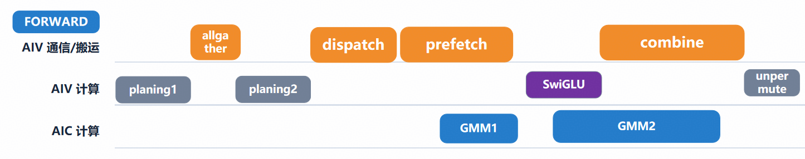

# 第七章｜MoonEP：负载均衡为什么值得焊进大算子

> **进阶篇 1/3** ｜ [返回目录](../README.md)

**一句话：木桶效应下，最热的专家决定整层耗时；MoonEP 用"热专家开分店（副本）"做负载均衡，而规划、推权重、算梯度回传这些事一旦离开大算子就会退化成一串 host 串行步骤——所以它必须进来。**

## 7.1 木桶效应

EP 把专家切到各卡后，最朴素的命运是：**router 说大家都要找专家 37，专家 37 所在的那张卡就成了急诊科**——别的卡算完只能等它。整层耗时 = 最忙 rank 的耗时，这就是木桶效应。传统解法是 capacity + drop（座位满了就扔 token，扔的是质量），或者在训练期加辅助损失逼 router 分流（那是路由算法层面的事，见 7.4 的谱系）。

MoonEP 的思路不同：**给热门专家开分店。** 每个 rank 除自己的 home 专家外，再接收若干**副本（replica）专家**的权重拷贝，路由时优先把 token 送到"离家近且不忙"的副本。

## 7.2 B.0–B.3：四步规划

副本怎么选、流量怎么分？MoonEP 在设备端跑一个四步规划（host 侧有一个纯 torch 参考实现，正好当教材）：

```python
# src/mega_moe/runtime/moonep_planning.py:238-249（摘）
def plan_moonep_b0_b3(tpe_all: torch.Tensor) -> MoonEPPlanningResult:
    """Build MoonEP B.0-B.3 tables for dropless Mega-MoE routing.

    Args:
        tpe_all: Contiguous CPU int32/int64 counts shaped ``[R, E]``. Every
            row must have the same sum, ``E`` must be divisible by ``R``...
    Returns:
        A result containing contiguous CPU int32 ``alloc_cumsum [E, R]`` and
        ``experts_to_copy [R, E/R]``.
    """
```

四步分别是：**B.0** 数清楚每个专家全网要接多少 token（得到各 home 组负载）；**B.1** 用"单源填充"求一张转移表 `transfers[R][R]`，让每个目的 rank 的总负载相等；**B.2** 按配额把每个 home 组的流量贪心切给各目的 rank（产出 `allocation`）；**B.3** 给每个目的 rank 挑出它实际需要的远程专家，填进**副本槽**——产出上面代码里的 `experts_to_copy [R, E/R]`（行话 ETC 表）。

副本槽预算在算子构造时就定死（注意 physical = 2 × home）：

```python
# src/mega_moe/ops/forward.py:126-133（摘）
if self.enable_moonep and self.world_size & (self.world_size - 1):
    raise ValueError(
        "MoonEP Triton planning requires a power-of-two EP world size")
self.replica_budget = self.experts_per_rank if self.enable_moonep else 0
self.physical_experts_per_rank = (
    self.experts_per_rank + self.replica_budget
)
```

规划完，路由把 token 映射到 `[home | replica]` 物理桶，之后前向照常跑——只是每个专家可能有多份权重拷贝在各 rank 上。

## 7.3 权重从哪来：owner-push 预取

副本要有权重才能算。规划一落地，**拥有该专家的 rank（owner）主动把权重 RMA 推进**所有需要它的目的 rank 的对称副本表——gate/up 按 16MB 块、down 按 4MB 块推，每块推完 `signal_op SET(届号)`。反向时倒过来：各副本上攒出的权重梯度，owner 把它们 pull 回来累加（owner-pull 归约）。

## 7.4 负载均衡方法谱系（横向视野）

把 MoonEP 放回谱系里看，负载均衡三代方法：

- **辅助损失（aux loss）**：训练时给 router 加一项"不均衡罚金"（Switch/DeepSeek 系），逼它雨露均沾——有效但和主损失打架，权重难调；
- **router z-loss**：罚 logits 的绝对值，稳定数值进而稳定路由（ST-MoE）；
- **免损失偏置（DeepSeek-V3 bias）**：给每个专家的得分加一个动态偏置，超载就调低——不用改损失函数，"排队叫号"式柔性引导；
- **expert choice**：反过来让专家挑 token，天生均衡但训练/推理语义有出入；
- **node-limited routing**：限制每个 token 只能路由到有限几个节点内的专家，砍跨机流量（通信维度的"均衡"）；
- **副本式（MoonEP）**：训练时不干预路由，系统侧用副本吸收不均——**前几类是"劝人少排队"，MoonEP 是"多开窗口"**。

## 7.5 实测效果：怎么量、量到了什么

负载均衡的收益怎么测？仓库里有一组刻意设计的**配对倾斜用例**（控制变量法）：

```python
# config/_shapes.py:239-256（摘）
# Matched unbalanced Kimi cases: only total expert count differs. Keep the
# old top-k=8 trimmed case above for existing performance regressions.
CaseGroup(
    prefix="performance-fwd-kimi-k3-trimmed-skewed", ...,
    topk=16, num_experts=32, ...,
    tags=frozenset({..., "moonep-skewed", "slow"}),
    capacity_factor=1.6875,
),
CaseGroup(
    prefix="performance-fwd-kimi-k3-skewed", ...,
    topk=16, num_experts=896, ...,
    tags=frozenset({..., "moonep-skewed", "slow"}),
    capacity_factor=1.6875,
),
```

设计意图写在注释第一行：**只有专家总数不同**（32 vs 896，即 8 卡下每卡 4 个 vs 112 个 home 专家），其余全部对齐——同一 token 分布、同一 hidden/ffn/topk、同一个 cf=1.6875（dropless）。专家越少，路由越集中，木桶效应越狠。两个 case 的 E2E 差值就是"倾斜税"；同一 case 开/关 MoonEP 的 E2E 差值就是"均衡收益"——物理槽翻倍后，最忙 rank 的峰值被副本摊平。

目前的实测现状（如实说）：

- README 的主性能表（前向 1.17–1.30×、反向 1.19–1.56×）是**无 MoonEP** 的 home-EP 路径；MoonEP 专项的开关对照数字**待补**（跑 `moonep-skewed` 配对用例后填入，见 README 待补清单）；
- 功能面：反向全路径已支持 MoonEP replica（`MOE_BWD_MEGA` 普通版与 recompute 版两条路径都打勾，见 README 功能表）；
- 整网集成：[MindSpeed-MM_MoonEP](https://gitcode.com/jzhoujg/MindSpeed-MM_MoonEP.git)（`moonep` 分支）提供 kimi-k3 端到端训练入口。

## 7.6 为什么必须焊进大算子

设想把 MoonEP 拆成框架层的小算子：规划（一次 collective）→ 权重推送（一次）→ 等待就绪（一次 barrier）→ dispatch → 计算 → 反向再来一遍梯度归约（三次 barrier）。每一步之间都是 host 往返 + 全局同步，**掩盖无从谈起，规划的开销可能把均衡的收益吃干净**。

进了大算子之后：规划在设备端跑（`_kernel_moonep_b0_b1`）；权重推送与 dispatch 并行（dispatch/FC1 混合 kernel 里，空闲的第二 vector 子核并发预取 down 权重）；梯度归约藏进反向的 push 窗口。**均衡的全部 overhead 都被流水线吃掉了——负载均衡不是大算子的负担，恰恰是大算子存在的理由之一。**



*三车道视角看这段话：planing1/planing2 排在计算道最前头，dispatch 期间通信道顺路捎上 prefetch（权重预取），SwiGLU 塞进 GMM2 的影子里——"overhead 被流水线吃掉"，吃就吃在这几块错位上。*

## 7.7 开发者注记（验证入口）

（给第三类读者）

- 正确性：`tests/layer/test_moe_suite.py::test_single_kernel_moonep_autograd_w2`（MoonEP 前反向一体的单测门）；
- 性能：配对用例 case id `performance-fwd-kimi-k3-skewed` / `performance-fwd-kimi-k3-trimmed-skewed`（见 7.5，开关 MoonEP 对照）；
- 整网：[MindSpeed-MM_MoonEP](https://gitcode.com/jzhoujg/MindSpeed-MM_MoonEP.git) `moonep` 分支。

## 7.8 小结

木桶效应 → 副本式均衡（B.0–B.3 规划 + owner-push 预取 + owner-pull 归约）→ 全部 device 侧闭环；收益用 moonep-skewed 配对用例量（倾斜税 vs 均衡收益）。**下一章讲另一个"必须进大算子"的设计：重算。**

---

← [上一章](06-npu-vs-gpu.md) ｜ [返回目录](../README.md) ｜ [下一章：重算](08-recompute.md) →
