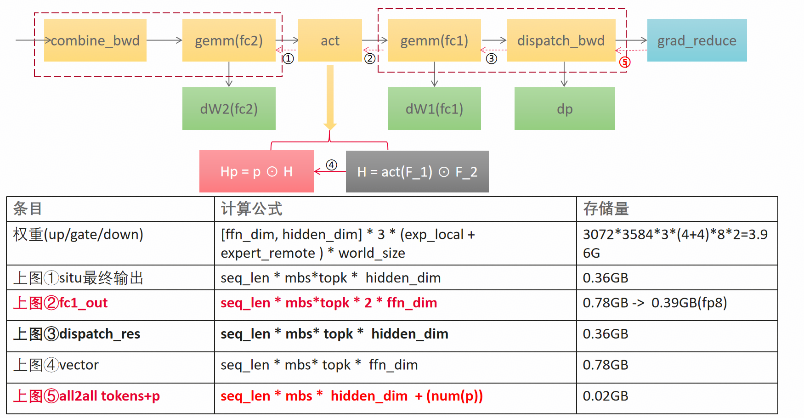

# 第八章｜省显存的艺术：重算怎么设计

> **进阶篇 2/3** ｜ [返回目录](../README.md)

**一句话：反向需要前向的"小票"，全存显存爆炸、不存反向没法算——重算的本质是"哪些小票可以扔掉之后重新排队补打"，而 MoE 的小票里有一类绝对不能扔：排列元数据。**

## 8.1 矛盾

第二章说过，反向要吃前向的一堆中间量：dispatch 后的 token、FC1 输出、路由元数据……`_native_saved.py` 里的完整契约有 39 个键。Kimi-K3 规模下，光 fc1_output 一项就是几百 MB 每层——几十层 MoE 堆起来，显存直接判死刑。

经典的解法叫 activation checkpointing（梯度检查点）：前向只存关键帧，反向要用时重算。MoE 的重算有自己的特殊性，设计成三问。

## 8.2 第一问：什么能重算？

**激活能重算。** FC1 输出、加权 SwiGLU 结果，都可以由"dispatch 后的 token + 权重"重新算出来——甚至 token 本身也能重算：拿着 `hidden_states` 和存的排列表，反向里重新 dispatch 一遍（re-dispatch 重发）。

## 8.3 第二问：什么绝不能重算？

**排列元数据绝不能重算。** `argsort` 的稳定序、每桶的计数/偏移——它们是前向"随机过程的快照"。你要在反向里重推一遍，得到的排列不保证和前向逐位一致（数值上等价但顺序可能不同），后面所有对数全毁。所以元数据永远是小份地、原样地存着：

```python
# src/mega_moe/ops/_native_saved.py:312-319（摘）
def snapshot_plan_metadata(op, plan: MoERoutingPlan) -> dict:
    """T1 — snapshot one routing plan for the native ``saved`` dict.

    Must run immediately after ``build_routing_plan`` returned ...
    Every returned tensor is a clone or a freshly computed value, so the
    single-in-flight planning workspace may be reused afterwards.
    """
```

## 8.4 第三问：什么时候存、存多久？

存激活有个**时间窗**问题——dispatch 的接收区是复用的，FC2 一开始往对端写结果就会覆写它：

```python
# src/mega_moe/ops/_native_saved.py:336-345（摘）
def capture_activations(op, dispatch_result, workspace=None):
    """T2 — snapshot the forward activations the backward needs.

    Call site: inside ``FusedMoEForward.forward`` between the ``dispatch_fc1``
    result and the ``_fc2_combine_shadow_activation`` launch. ... this window
    is mandatory because FC2's device-put workers and backward step 1 both
    overwrite the peer-memory receive view.
    """
```

T1（规划快照）→ T2（激活捕获，必须在 FC2 覆写之前）→ T3（组装 39 键 saved）——三段式，一步都不能错位。

## 8.5 重算路径：最小 saved 契约

单 kernel 前向 + 融合反向组合下，前向只存**最小契约**（fc1_output + 接收布局表），大的 token 矩阵反向时在 kernel 内重推。代码里的准入条件写得明明白白：

```python
# src/mega_moe/ops/backward.py:123-143（摘）
# Single-kernel-forward minimal contract: the big activations are
# NOT saved — the fused mega backward re-derives them in-launch
# (recv_hidden via re-dispatch, act rows from fc1_output).  Only
# that one combination may run without recv_hidden_sorted ...
_single_kernel_recompute = (
    "recv_counts_by_source_expert" in saved
    and "fc1_output" in saved
    and "recv_weights_sorted" in saved
    and os.environ.get("MOE_BWD_MEGA") == "1"
    and os.environ.get("MOE_SAVED_RECOMPUTE", "1") == "1"
)
```

注释就是设计文档：**大的激活不存，融合反向在 launch 内部重推**——`recv_hidden` 用 re-dispatch 重发补，激活行从 `fc1_output` 重新展开。代价是反向多一遍 dispatch 通信和一遍 GEMM，换来的是前向侧那几百 MB 的显存自由。



*重算章节的图：反向主线（combine_bwd / gemm / act / dispatch_bwd）照常算，被扔掉的激活从存下的小票重算补回；右侧的内存账就是 8.6 菜单的行情表——fc1_output 约 0.78 GB、压成 fp8 只要约 0.39 GB，权重约 3.96 GB 常驻不动，而 all2all 的 tokens+p 这类元数据只有约 0.02 GB（所以 8.3 说元数据永远原样存，存得起）。*

## 8.6 三档省显存菜单

重算不是唯一选项，实际是一档菜单，按代价从低到高：

1. **压缩存**：`save_fc1_dtype` 支持 fp8（E4M3 + 逐行/逐组 scale，约省一半）或 fp16——存个小一号的复印件；
2. **搬主机**：`MEGAMOE_FC1_OFFLOAD=1` 把 fc1_output 挪到 pinned 主机内存，反向入口再搬回来——把仓库从显存这块黄金地段搬去郊区（代码思想见第五章 5.5）；
3. **全重算**：`MOE_SAVED_RECOMPUTE=1`，如上。

**为什么说重算本质是 trade-off？** 因为它拿两样最贵的东西（通信带宽、计算时间）换一样最贵的东西（显存）：re-dispatch 重发要多跑一遍 A2A，act 重展开要多跑一遍 FC1 类计算；而它换来的显存，恰好是长序列/大 batch 训练能不能跑起来的硬门槛。**没有免费的午餐，只有按行情兑换**——什么时候兑换划算，取决于你的瓶颈是显存还是墙钟：显存溢出 → 必换；显存富余 → 别换（白白多跑一遍通信）。三档菜单的意义就是让你按预算点菜，而不是被"全存"或"全算"二选一绑架。

## 8.7 开发者注记（开关速查）

（给第三类读者）

- `MEGAMOE_FC1_OFFLOAD=1`：fc1_output 搬主机（pinned 池 + 旁路 stream）；
- `MOE_SAVED_RECOMPUTE=1`：全重算——注意必须与 `MOE_BWD_MEGA=1` **同开**，代码里是 AND 条件（8.5）；
- `save_fc1_dtype`：`fp8` / `fp16` 压缩保存，构造 `FusedMoEForward` 时传入。

## 8.8 小结

能重算的是激活（token 重发一遍即可），不能重算的是排列元数据（快照必须原样存），存的时候卡 T2 窗口；省显存三档：压缩存 → 搬主机 → 全重算，本质是通信/时间换显存的行情兑换。**最后一章，讲这套系统的皇冠：前向的全局流水。**

---

← [上一章](07-moonep.md) ｜ [返回目录](../README.md) ｜ [下一章：全局流水](09-global-pipeline.md) →
