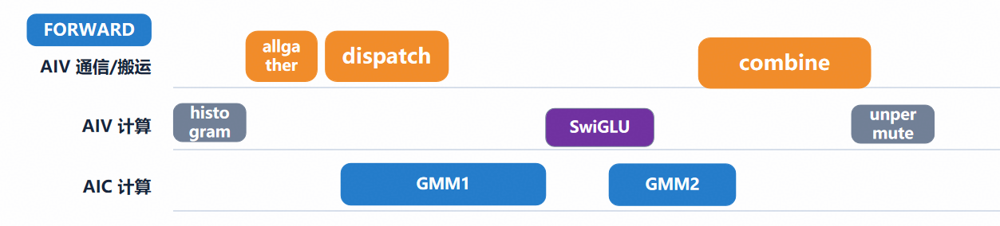

# 第九章｜前向的全局流水，以及为什么后向没有

> **进阶篇 3/3 · 压轴** ｜ [返回目录](../README.md)

**一句话：前向敢做全局流水，是因为它的数据流是一条链、且每个环节都有细粒度信号可以放行；后向的数据流是网、wgrad 是全量归约、barrier 进不了循环——三条锁死，只能做相位制 + 段内并行。**

## 9.1 全局流水长什么样

`enable_single_kernel_forward=True` 时，整个前向（路由、dispatch、FC1、激活、FC2、回传、combine）在**一次 all-core launch** 里完成，核心是 `_run_dynamic_wave_pipeline` 的**三级软件流水**。真实代码的循环骨架：

```python
# src/mega_moe/kernels/fused_forward.py:1266-1274, 1328-1347（摘）
global_waves = 0
for rank in range(WORLD_SIZE):            # 波数 = 全网最忙 rank 的波数
    blocks = tl.load(wave_expert_offsets_ptr + ...)
    global_waves = tl.maximum(global_waves, tl.cdiv(blocks, WAVE_WINDOWS))
...
# Empty receive ranks still dispatch every global wave. Keeping dispatch
# ahead of all return waits prevents a cross-rank dependency cycle.
for step in range(global_waves + 2):
    with al.scope(core_mode='vector', disable_auto_sync=True):
        if (sub_vec_id() == 1) & (step > 0) & (step + 1 < global_waves):
            _dispatch_dynamic_wave(pid, step + 1, ...)   # 发下一波
```

专家按窗口分组（每波 WAVE_WINDOWS 个 tile），同一个 `step` 迭代里**错位执行四个波次的工作**：

```text
step:        0     1     2     3     4   ...
vector 派发:       w0    w1    w2    w3         ← 子核1：永远发 step+1 波
FC1+激活:          w0    w1    w2    w3         ← cube GEMM + 0号车道激活
FC2:                     w0    w1    w2         ← cube，落后一格
回传 combine:                  w0    w1         ← vector，再落后一格
```



*把镜头从"波"拉远到整条生产线：AIV 通信/搬运道上跑 allgather、dispatch、combine，AIV 计算道上跑 histogram、SwiGLU、unpermute，AIC 计算道上跑 GMM1、GMM2——dispatch 与 GMM1 错开、SwiGLU 藏进 GMM2 的影子、combine 收尾，就是上面那张 ASCII 图的工程版。*

生产线转起来之后：dispatch 的搬运盖住了 FC1 的等待，FC1 的产出盖住了 FC2 的启动，FC2 的完成盖住了回传——**每一波在四个工位上同时有人在忙**。同步全部走第四章的细粒度信号（波内 ADD/SET 握手 + `dl.wait`），全局 barrier 只出现在头部元数据阶段，进流水线后一次都不要。

两处神来之笔单独说：

1. **`global_waves + 2`**：多跑两拍是流水的 fill/drain——头两拍只能发不能算，尾两拍收尾；
2. **空 rank 也要发满所有波**（代码注释原文：*Keeping dispatch ahead of all return waits prevents a cross-rank dependency cycle*）：如果没活干的 rank 提前收工不发了，别的 rank 的回传等待和它的 dispatch 就可能互相等出**跨 rank 依赖环**——分布式系统里"没活干也要在场"的经典智慧。

## 9.2 读懂数据：SYS_CNT 相位打点（性能方法学·下）

流水线调得好不好，不能靠感觉，得拍 X 光。单 kernel 前向支持在同一个 launch 里打相位点：`MOE_FWD_TIMING=1` 时，kernel 用内联汇编读硬件时钟：

```python
# src/mega_moe/kernels/common.py:86-101（摘）
@triton.jit
def _sys_cnt_tick(dummy):
    """Read the NPU system clock (SYS_CNT, ~1 GHz on this part ... —
    calibrate host-side against a known-duration launch). The inline-asm
    form ... proven to lower on this toolchain; ``is_pure`` must be False
    or the compiler hoists/CSEs the reads away."""
    return tl.inline_asm_elementwise(
        asm="MOV $0, SYS_CNT;", constraints="=l,l",
        args=[dummy], dtype=tl.int64, is_pure=False, pack=1)
```

打点存进每 program 一行的时间戳数组，host 侧按"每段 = max(结束) − min(开始)"归约。三条使用纪律（全是实测换来的）：

1. **cube 侧的墙钟只能由 vector 车道括出来**——cube 引擎没有向量/标量 ALU，你放在 cube scope 里的计时运算会被整块丢弃，所以"FC1 花了多久"要用 vector 侧的进入/退出时钟夹出来；
2. **跨运行只认原始 ticks**：SYS_CNT 的频率随环境波动（实测校准 958–993 ticks/µs，±3.6%），换算成 µs 再跨分支比较会引入这个量级的误差；
3. **打点本身零侵入**：`TIMING` 是编译期开关，关掉时打点代码整个不存在（dead-arg 模式，`_phase_stamp` 的 docstring 明说打点现场全部编译消失）——测量的存在不能改变被测对象。

拿这套打点看 Kimi-K3 单 kernel 前向的真实一次采集：routing 元数据合计 10.0 ms，占 kernel 的 **35%**，其中 route_scatter 5.66 ms（单 vector lane 稳定散射、另一子核空转）+ counts_publish 2.68 ms（pid0 单核 ~28 672 次依赖链 load）。针对性优化后 **10.0 → 3.4 ms、e2e 28.0 → 23.0 ms**（2026-09-19）。——**没有内窥镜，你永远不知道流水线其实三分之一时间在排队。**（这份数据也是第六章 vv 融合讨论的实证来源。）

## 9.3 为什么后向没有全局流水

对照本章开头的三条锁：

**第一，前向是链，后向是网。** 前向六步单向依赖，天然可以错波；后向 P2/P3 同时吃 P1，P4 要等 B1/B2/B3 多个前序（第二章 2.5 的依赖图）。网没有"下一波"可言——每个节点的放行条件是多个前序的**与**，你只能等齐，等齐就是 barrier。

**第二，barrier 进不了设备循环。** mega 反向模块头部记录的硬件铁律：**barrier 不能放在设备 for 循环里跨 SSA 值**（会 wedge 全 rank）、cube scope 内禁止 reduction、grid 必须是 `(ncore,1,1)`。全局流水恰恰需要"逐波放行"，而放行原语（barrier）被锁死在循环外——结构性的不可为。

**第三，wgrad 是全量归约。** 前向的行是"来一行算一行"；反向的 dW1 要吃满该专家**所有行**的贡献才能发布（第二章 2.4 说过归约维是 token）。全量语义和流式的"边到边算"天然矛盾。

再加上一条现实的：反向同时在飞的东西多（dy、四个梯度输出、可能的重算中间量），波缓冲再翻倍，显存吃不消。

**所以后向的最优形态就是第三章那幅相位图**：B1–B4 把网切成段，段内能并行的全部并行（P2∥P3、P4b∥P5a、P4c∥P5b），P5 藏进 push 窗口。这不是妥协，是依赖结构下的极限。

## 9.4 开发者注记（打点工具链）

（给第三类读者）

- 采集：`MOE_FWD_TIMING=1`，读数用 `read_last_forward_phase_timing()`；
- 归约：`benchmark/layer/_fwd_phase_timing.py`（纯 host 归约脚本）；
- 独立用例：`pytest tests/layer/test_fwd_phase_timing.py -m dist`——**一个节点只跑一种变体**（case × saved/unsaved × save_fc1_dtype），JSON 落 `MOE_FWD_TIMING_OUT_DIR`（默认 `results/fwd_phase_timing`）。

## 9.5 小结

前向：一条链 + 细粒度信号 → 三级波流水，一次 launch 跑完全层；后向：一张网 + barrier 铁律 + 全量归约 → 相位制 + 段内塞满。**判断一个计算能不能流水化，先画它的依赖图——链可流，网只可切。**

## 尾声

九章看完，回头看第一章那三笔账，你应该能对着代码说出每一笔是怎么赚回来的：通信计算掩盖（第三、五、九章）、host 开销（第三、九章）、内存反复读取（第三、八章）。

再啰嗦一句方法论：这个仓的代码里到处是带日期的注释（"Re-tested 2026-08-13 ... 12.5x SLOWDOWN"、"scattered per-site form ... overflowed UB (2026-09-17)"、"10.0 → 3.4 ms（2026-09-19）"）——**每一句都是一次真机上的实验记录**。写 kernel 的正确姿势不是想清楚再写，是写一寸、测一寸、记一寸。纸上得来终觉浅，绝知此事要躬行。

以上。

---

← [上一章](08-recompute.md) ｜ [返回目录](../README.md)
